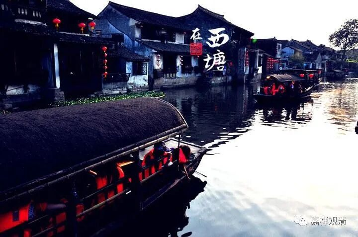

**《微课佛教史》178·2**

其实这个时期禅宗在皇家内道场的地位是很高的。（当然，在这个时候“禅宗”这个概念是不是存在，还是另外一回事。）如果以后有机会的话我们还会再讲这个话题，我估计今天大概谈不到了，但是这件事情我肯定会讲的。我现在讲课的思路，不一定会随着现在的书本来走。

神秀大师就这样得到了皇家的极力推崇，皇帝没事就经常去看看他，提一些问题，当然这些问题绝对不是后来的机锋禅。你们不要去看后来的传记，后来的那些传记把他的语录也变得和机锋禅一样，其实当时不是这样的，不要这么想。

后来表彰神秀大师，皇帝又在洛阳给他建造寺院。连皇上都是跪拜着去迎接的，那么普通老百姓去迎接他的人就更多了，是吧？其实这里面还有一个原因，就是神秀大师的年纪确实是大了，所以用轿子把他抬上来也是一种对年长者的尊崇。中国人也是有这样的习惯的，如果这个时候神秀大师只有二十岁的话，肯定不会这样。

昨天讲完之后我又查了一下资料，我昨天好像讲那玄赜禅师和老安禅师也是三朝帝师，实际上历经三个朝代的应该是神秀大师一个人，所以说他是“三朝帝师，两京法主”，三代皇帝一直到唐睿宗都是尊他为国师的。前面武则天已经这样尊重了，后面的皇帝肯定也是非常的尊重。包括当时的中书令张说——也可以算是宰相了，也向他问法，在他门下执弟子礼，说明神秀大师当时的世俗地位也非常高。

这种地位绝对不是一个仅仅靠打机锋、玩脑筋急转弯的人可以获得的，不是。我们应该理解为神秀大师学问不错，禅修功夫也很高，声望又很高，再加上是东山法门的继承者，所以受到皇家的推崇——应该是从这样的角度上来考虑。

神秀大师圆寂以后，他的碑铭就是中书令张说给写的。然后他的弟子普寂禅师和义福禅师也是被当时的朝廷所推崇，这个我们在后面还会讲到。

所以这就是禅宗当中比较有名的“南能北秀”当中的北秀这一支，后来又有说法称为“南顿北渐”，意思是说神秀大师这一支是渐修，而南方是顿悟，那么，是不是这个情况呢？我们明天分解。

