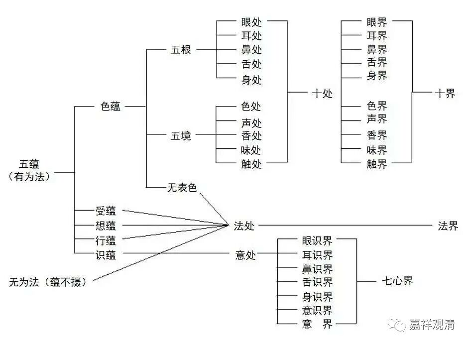

**《集论选讲》179·3**

所以“十八界”里的“界”也是一样，在印度的梵文当中出现了这个“界”字，“界”是什么意思呢？这个宗派就挑选了种类的意思，那个宗派就挑选了能生的意思，这个宗派又挑选了能持的意思……是不一样的，在这些挑选的背后是要为他们的哲学所服务的。

大家可以比较一下中文来进行理解，比如说在儒家的经典当中，大家都会去对照《说文解字》里面的解释，在此背景下去谈论某个字，甚至还要谈出它的哲学意思。同样的情况其实在近现代也出现过，是吧？“……的书我最爱读，千遍那个万遍呀下工夫，深刻的道理我细心领会……”每个字我们都要找出来是什么意思，甚至背后有什么意思。当它成为经典以后，它的性质就完全变了，解释的人就要千方百计地往经典上去靠。

在佛陀教授的内容成为经典以后，也是这样，大家都要在佛经的文字基础上各自解读。比如说，佛如果没有讲过什么叫“界”，就会出现解读的空间。当然，并不是说他存心要留出解读的空间，实际上一定会有人问要怎么解释，那就必须在印度或者梵文的传统背景下去进行解释。所以有时候这些解释未必是佛陀的，它是印度的。

** 问：何因处唯十二？答：唯身及具能与未來六行受用为生长门故。谓**如过现六行受用相为眼等所持，未來六行受用相，以根及义为生长门亦尔。所言“唯”者，谓唯依根境立十二处，不依六种受用相识。

那么“处”的意思就是能生，我们前面讲过，就是能生识的门。

前两天我们还发过一张图，就是“蕴、界、处”三者之间的对照表。相对来说，“蕴、界、处”本来是各别独立谈的，不是在同一部经典里面谈的。但是由于“蕴、界、处”都是在谈一切法，那么它们相互之间就要有对应关系。如果你死抠这些对应关系的话，就可能会出现一些问题。

