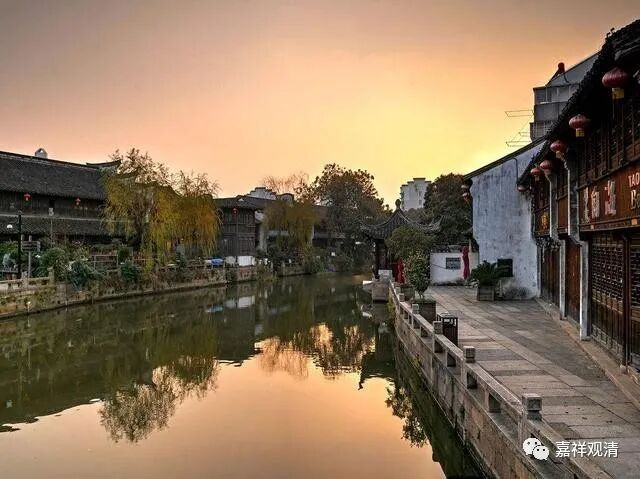

**《微课佛教史》181·1**

大家还记得金庸写的《侠客行》里面，那个雪山派的掌门老头叫“白自在”，他的天资很好，对吧？“白自在”就是金庸比喻那种狂禅的，觉得自己天下第一了，是吧？实际上是因为他服食过雪山上异蛇的蛇胆蛇血，从而内力大增。

所以真正来说，在这里“渐修”和“顿悟”才是一对概念，而不是“渐悟”和“顿悟”。“悟”哪有“渐”的？“悟”必须是“顿”的！“修”哪有“顿”的？“修”只有“渐”的！那么，在中国佛教发展的后期，由于一些人在学习的时候逻辑性不强，对文字的把握不够严谨，在听到“渐修”、“顿悟”之后，慢慢就变成“顿悟”和“渐悟”这样的说法了。

应该说，如果你真的穿越回去问神秀大师，说：“你是‘渐悟’派的。”他肯定不承认的，哪个人会承认“渐悟”啊？“渐悟”这个事情是不可能的。应该是“渐修”！如果你去问慧能大师，肯定也是“渐修”、“顿悟”。他们俩是不会有区别的。如果说，“渐悟”等于“次第证”，“顿悟”等于“超越证”，那次第证和超越证二者都是最正常的修行方式了，不存在哪个正确哪个错误这样的差别……

如果说一定要有区别，那也只是两个人所针对的化众不同，他们要讲的内容是有区别的。比如说慧能大师，我们大家都知道即使他是有文化的，但文化程度也没那么高，你让他讲经典是不太可能的，对吧？于是他就讲禅法，看起来好像是直指人心，为什么呢？因为他是没有能力去开演《华严经》、广讲《瑜伽师地论》的，是吧？当然，书里面说他也曾经讲过经典，不过这是后来的说法。实际上他的文化水平不那么高的，你让他讲色当中分几个，色的定义又是什么……这些显然不是他的强项。

另外一位神秀大师是什么情况呢？他原先在儒学方面弟子就是挺好的，就是一般社会上的文化都学得挺好的，然后他又在北方政治经济中心活动，而那个时候北方的经济文化比较发达，也有士大夫阶层在跟他学习的，对吧？那些学习的人就会来问一些问题，肯定都是佛学方面的，或者说是相应佛学方面的（前有玄奘、法藏、义净开路，士大夫对佛教的理解会比较正统一点）。如果有人来学禅，那么就讲讲禅，如果有人来学经教，那么就讲讲经教，对吧？所以看起来，被南方的菏泽神会大师那么一“争是非”，楷定了禅门宗旨，变成了好像北方是不玩这一套的。其实北方不是不玩，只是他的侧重点可以更多。

今天好像讲得有点多，大家姑且听一听吧。

