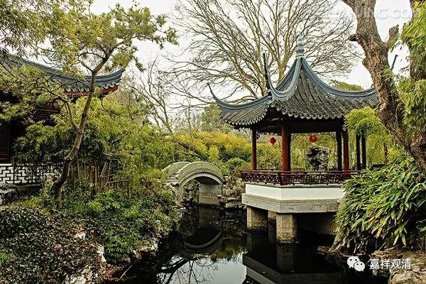

**《集论选讲》012·3**

今天我们讲“根本色”的白，应该是骨头那个白，或者眼睛的那个白，这些和“循身观”、“白骨观”等系统都有关系。“骨锁”等事也是一样。锁，就是关节。骨头和骨关节连起来，总得有个次序吧，不是一堆骨头往那一放的。在观想的时候，观想自己，然后是周围，比如说一个村，乃至一直到四天下，整个世界都是白骨，这样去观察，所以它会有东南西北的“方所示现”。比如说东胜神洲、西牛货洲、南瞻部洲、北俱卢洲，全部都布满了白骨，这样去观察，最后再观想到自己面前的一尊白骨，然后再观想回眉间的白骨，或者白骨的眉间……就是从一到无量，再从无量到一，最后摄为一点，心一境性，然后在这里入定。

所以，佛讲的这个“色”，简单来讲可以说就是物质，只是后面提到了“法处所摄色”，所以单纯讲“色就是物质”不是很好、不算很精确。现在我们单纯用物质来理解“色”，比较容易，只是有个别的不能算物质。（说起来，色，大部分来讲应该算物质，只是“法处所摄色”有不同的理解而已。）

那么，佛谈这个“色”，或者说谈物质的“方所示现”，就是在什么地方，还是和禅修、实修有直接关系的，佛谈这些事情不是泛泛而谈的。假如说突然出现了一个人创教，开始谈论物理学，你真的爱听吗？

我们差不多理解到这样就可以了。“骨锁等所知事，同类影像”，“骨锁想”、“脓烂想”、“青瘀想”等等，都可以。

如是如是色者，谓形、显差別。种种构画者，谓如相而想。

在“色”当中，或者说在物质当中，在前面讲的“触对变坏”、“方所示现”当中，有形色、显色、表色的差别。“种种构画”，就是前面那个词，叫“寻思相应种种构画”。“构画”就是“想”，就是后面“五遍行”的那个“想”心所，或者“色受想行识”的“想”。“想蕴”的“想”就是“构了为性”，或者“取相为性”。

“或由定心，或由不定，寻思相应种种构画”，在定当中，或者在不定的时候，有这些“想”。“想”什么呢？构画种种的颜色、方所和大小，比如说白骨观，大小啊、长短方圆啊等等，或者观想文殊菩萨——黄文殊，有大小，也有颜色，对吧？红文殊、黄文殊、白文殊……这就是显色，它的颜色是什么。“如相而想”，就是该怎么“想”就怎么“想”。

好，今天就先讲到这里吧。

来复习一下。我们讲了“色蕴”，是什么呢？“变现相”为相。《集论》当中“色蕴”的“色”是“变现”。“变”是什么呢？是“触对变坏”当中拿出一个字来，叫变。“现”是什么呢？就是第二个“方所示现”当中拿出一个字来，叫“现”。什么是“色相”？这个“相”就是定义、性相或者说本质。那么什么是“色”呢？就是“触对变坏，方所示现”。大家都偷懒，用两个字能不能表示呢？好，两个字的话就是“变现相”，或者叫“变坏相”也可以，也有叫“质碍”的。藏传也有个说法，叫“堪为色者”，学梵文的人说他们翻译错了。

好，今天我们先到这里，讲了一个“色蕴”的“色”——“变现”。谢谢大家！

