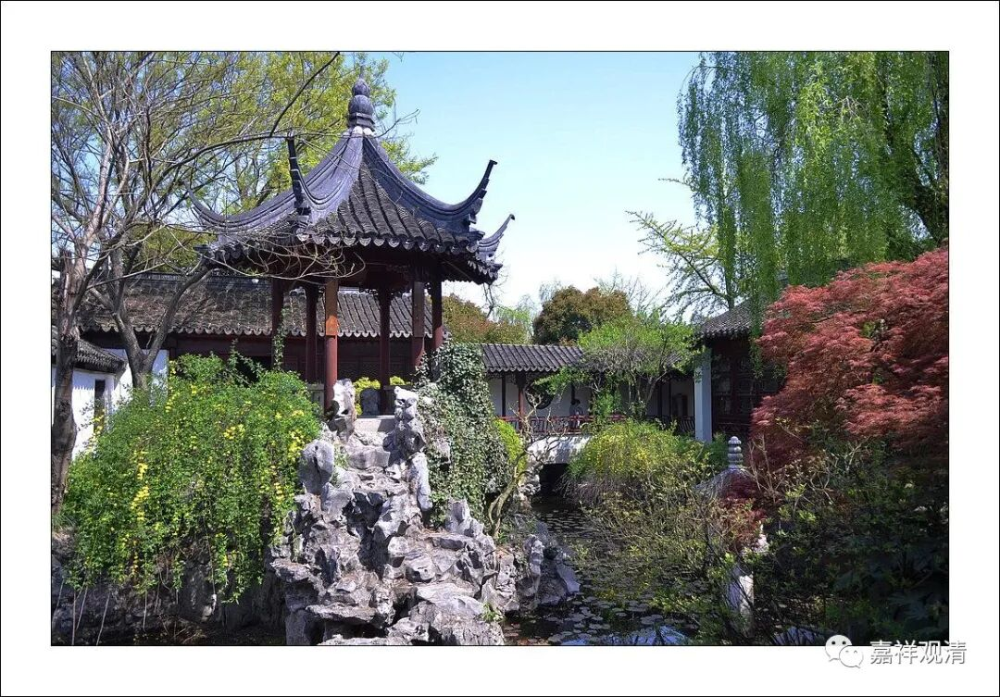

**《微课佛教史》182·2**

我们再以日本的禅宗作比方，日本现在的禅宗是三大宗派：一个是临济宗，一个是曹洞宗，还有一个是黄檗宗。实际上黄檗宗应该是属于临济宗的，但是它在日本就成为一个新的独立的宗派，所以日本就分为这样三派。

日本的禅宗是怎么学习的呢？他们完全不是今天我们中国的这个样子，人家是把禅宗的公案都背出来的。他们有很多禅宗的公案，而且肯定都是从中国过去的，那都是要背的。总共有一千多个公案，好像是一千六百多个吧，这些公案全都要背出来，滚瓜烂熟。从这个角度来讲，我们后期的禅宗就有点不靠谱。

如果我们把这一千六百多个公案都讲了，实在太多了，是吧？现在还有台湾的星云法师他们，还专门编纂了《禅藏》。禅宗的文献实在是太多了，即使这样，还有很多是流失了，没流失的数量就不得了了……

但是如果以历史演变的角度来看，其中的变化也是很大的，同一位住持的不同的语录，也可以有很大的差别。我们可以想象一下，同一位禅师的故事，可能传播个一两百年的话，就已经发生很大的变化了。那么，更注重口头传承的印度呢？……

我们还是继续回到禅宗史，昨天是谈到了关于禅宗的顿悟成佛和渐修的一些问题。我们说，禅宗的顿悟说其实是“接着”南北朝时期的学术脉络来谈的，我们用的这个词是“接着”，冯友兰先生就是讲用这个词的，“接着”，而不是“照着”。这两者之间是有区别的：“接着”的意思是说它会发展出自己的新东西；“照着”就是完全按照之前的了。所以说禅宗的顿悟和般若或者说中观这一系的的小顿悟或者大顿悟说是有区别的。

禅宗的这些顿悟说是非常零散的。比如说，我可以总结出这个顿悟成佛就是指十地菩萨最后成佛的那个时候，另外一个人可能说这个顿悟成佛是指初地菩萨，或者是指八地菩萨，甚至另外一个人可能说顿悟成佛是刚入道，这些都是有可能的。

其实禅宗当中各人的观点并不完全统一，可能我这么说都已经很给面子了。你甚至都不能够说是“不完全”统一，简直就是五花八门。如果以宗见的角度来说就比较麻烦了，就是从“宗义”的“成就的极限”来说（在藏传佛教中的说法叫“成就的极限”）。如果要以宗义的建立，比如说教道果的形式来谈禅宗，你会发现根本就没有（明确的教道果）！这也是中国很多“宗派”的一个通病——没有发展出成建制的体系。

