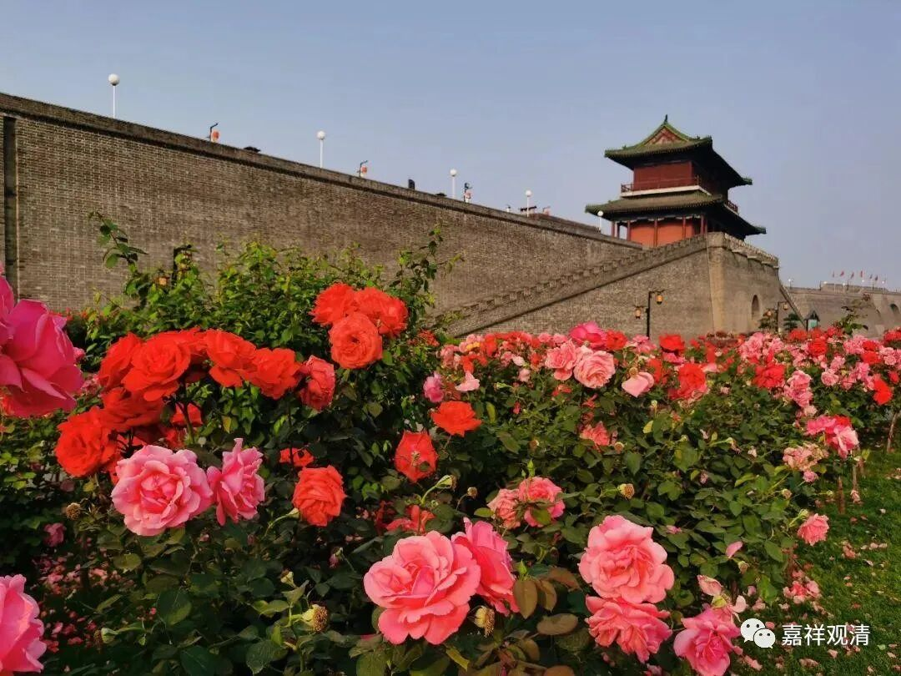

**《微课佛教史》186·2**

那么禅宗里面对这个“法身”怎么理解呢？现在有些人开始站出来说，“顿悟成佛”所“顿悟成”的是法身佛，他这个所谓的法身佛的意思是什么呢？用我们今天的话来讲就是空性。我们可以这么理解，假如说我自己站在禅宗的立场上，我要维护禅宗的这个说法，怎么说呢？首先是证得法身佛，其次是“悟后起修”——修报身。“先证法身再修报身”用教下的话说，禅宗的意思就是证得空性以后，见道以后，修什么呢？修福德资粮和智慧资粮等等，继续增上，再修报身、化身等等。

所以禅宗里面的这些人说，我们“顿悟成佛”，成的是法身佛，后面还是要修的，修什么呢？修报身和化身。“顿悟成佛”的时候所成的不是究竟圆满的释迦牟尼佛的这种佛。也就是说，起初，竺道生的观点是要直接顿悟到“金刚以还，皆是大梦”的境界（顿悟到十地都不够，要直接顿悟到成佛），后来开始觉得在实践上好像不太容易。你说马大师门下出现一百多员大善知识，全是佛吗？而且理论上已经很明显了，如果你学佛教理论的话就会知道，一个时代只能出现一尊佛。比如说现在是贤劫，只能出现释迦牟尼佛一个。其他的都不行，一个时代不可能出现两尊佛，否则可能出现两套教法，大家要掐起来了——至少佛教的传统说法是这样的，说同一时间段不能在一个世界二佛出世。

所以呢，就出现了“悟后起修”的这个说法。那么，“悟后起修”的说法和之前的说法肯定是有差异的，因此在禅宗里面也是有争论的。已经是大悟成正觉了，哪还有“悟后起修”呢？禅宗当中保守的一派就认为不存在“悟后起修”的问题，如果要“悟后起修”的话，那就是没悟。因为“见性成佛”，你这不是佛啊！另外一派呢，他们去观察了，就说不行，“悟”了以后好像还不是“一切智”“一切知”，就实践上来说必须是“悟后”还有“修”的，很明显地（除了佛陀释迦牟尼本人）不存在“悟”了就到佛地的情况。所以禅宗里面是有这样的一个争论：到底是“一悟成佛”还是“悟后起修”？

一般来说“先修后悟”，是吧？“先修后悟”是很正常的吧？说实话，“悟后起修”确实……怎么说呢？要从经教来讲吗？反正如果要辩论或者讨论的话，也不是没有问题可以讨论。但他们好像也已经说通了，就是“悟”了之后，就相当于先证了一个灭谛——这么说好像还可以。就是先证个见道，或者说最初的灭谛，然后再“修”道谛，之后还得证究竟的灭谛，是吧？前面的那个见道证空，还不是究竟的无余涅槃（无住涅槃）……

