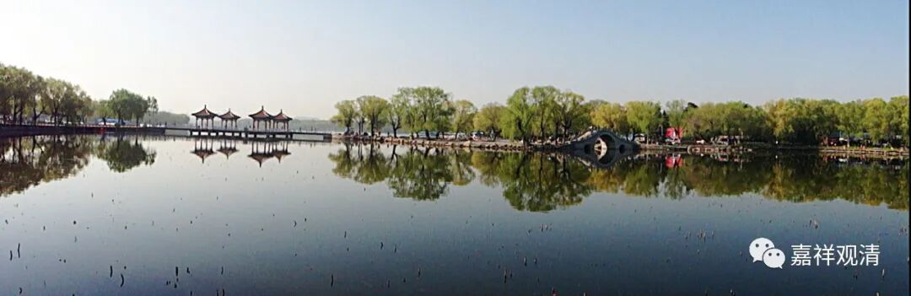

**《集论选讲》016·1**

我们继续《集论》选讲。

好像大家对“四大”还有些兴趣，可以去查一些经典。

从大的方向来说，“四大”在印度的婆罗门教文化当中就有，或者说是印度的雅利安人文化当中自带的。雅利安人和现在的欧洲人都属于白种人系统，最初，从高加索附近一个往南，一个往西，所以他们在很多地方都比较相似。我们谈到过，希腊文化当中也有类似“地、水、火、风”的说法，只是印度的说法是这四个是平行的，而希腊的说法是物质的根本是水或者火，被称为“原子”。

在佛教当中，这种“原子说”最后被肯定下来不是那么早期的。我看到大家去佛经里面去找了一些资料，如果仔细看的话，会发现比较早期的“地、水、火、风”和后期的“地、水、火、风”，其实讲的并不是一回事儿。或者说，至少早期的时候没有像后期讲得这么哲学化，没有出现宇宙生成论的这些内容。所以早期所讲的“四大”是比较泛泛的，并没有像后期讲得这么“清楚”。

从阿毗达摩——《集论》这个角度来讲的“四大”，和我们世间所理解的“地、水、火、风”是不一样的。其实佛教早期所讲的“四大”，大致上就是我们所见到的“地、水、火、风”，但是哲学化、精细化以后，它的概念就变化了。后期的阿毗达摩认为什么呢？我们外面看到的“地、水、火、风”叫“假四大”，意思就是它不是真正的“四大”。“大”，就是因的意思，就是产生这个物质世界的终极的根本。

你不能说我们现在肉眼看到的这么大的“土”是物质的终极的根本，因为我们可以发现“土”里面还有“水”，以中医来说的话，还有“金、木、水、火”。如果单纯的以我们世间所看到的这些，那是不够“基础”的，不够“原子”——基本粒子的。所以再往后分析的话，就发现我们世间所认为的“地、水、火、风”后面还得有更基本的组成元素，有些人就提出世间“地、水、火、风”的基础是更细微、细微到极致的“地、水、火、风”，最终就形成了类似于“原子说”的四大说。在此背景之下，“地、水、火、风”的性质就和最初泛泛讲的不一样了。

