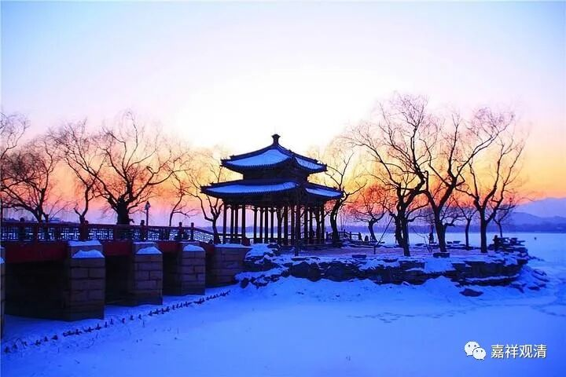

**《微课佛教史》197·2**

而且，我们再看一个很有趣的情况，就是我们中国人的习惯可能是以左为尊，但印度人的习惯是以右为尊，所以这里面又出现了一个问题。在中国汉传佛教的大多数寺院当中，释迦牟尼佛下面的这两尊罗汉，年轻的阿难尊者是在释迦牟尼佛的右手边，而年老的迦叶尊者是在释迦牟尼佛的左手边，这种形制是有问题的。（当然，如果“浪漫”一点的话，哪一种都可以。我们说艺术的浪漫是怎么都可以的，比如像汉地的弥勒菩萨，小孩骑在他头上都可以。）但是按照佛教的规矩，应该是以右为尊的，而阿难又是迦叶的弟子，所以阿难应该在佛陀的左手，迦叶应该在佛陀的右手，这才是比较符合佛教的做法。但是现代的佛教一般都不注意这个问题。

我大概在十五年前的时候，和河南的一位诗僧专门聊过这个问题，他也是一位住持。他本人的故事也挺可怜的，就是郭德纲的相声当中讲的，我们天天开玩笑的有些事情都曾经发生在他的身上，很可怜的。后来呢，他出家了，是在年纪比较大的时候出家的，他以前是高中的校长。关于他的事情我就不多讲了，你们如果想要了解的话，我们可以私下聊，这个故事也不太好。前几年，他已经圆寂了。

他在那个时候听到我聊这个问题就挺服我的，一直管我叫师父，但我一直没收他这个徒弟。没想到几年以后，他就圆寂了。在他建造的寺院当中，他就纠正过来了，就是在释迦牟尼佛的两边，右手边站的是迦叶尊者，左手边站的是阿难尊者。他这样做了以后呢，很多人都说他这样做得不对，然后他就说：“看得懂的人，会知道我这样做是对的！”很可惜，他圆寂了。

这个人真的很可怜，委屈了大半辈子，终于出家，也算是解脱了。所以，有时候在社会上“向上走”不一定是好事情。唉，很可怜的，他又不能辞职什么的，很可怜啊！

（关于释迦佛、迦叶、阿难像的位置的改变，我有点实物资料给大家看的，不过这两天在外面，网络不太好，照片没法奉上，等过段时间我专门开一贴稍微讲讲吧……现在我们只要大致地知道“阿难像在释迦佛右手边、迦叶在左手边”这种形式不会早于明代出现就行了。）

那么关于迦叶和阿难的故事呢，有很多，最有名的就是关于两人之间传法……迦叶是阿难的老师，是吧？在释迦牟尼佛圆寂的时候，迦叶已经是四果阿罗汉了，而阿难才是初果。然后迦叶就逼着阿难去证果，阿难一直迟迟没有证果。到了最后那天晚上，阿难觉得实在不行了，想要睡一下，头快要沾到枕头的时候，按照禅宗的说法，就突然之间开悟了，证得了四果，就进了七叶窟，参加了结集。阿难是“多闻第一”，于是他就在那里诵佛经。——这个故事《大智度论》有完整的记载。

