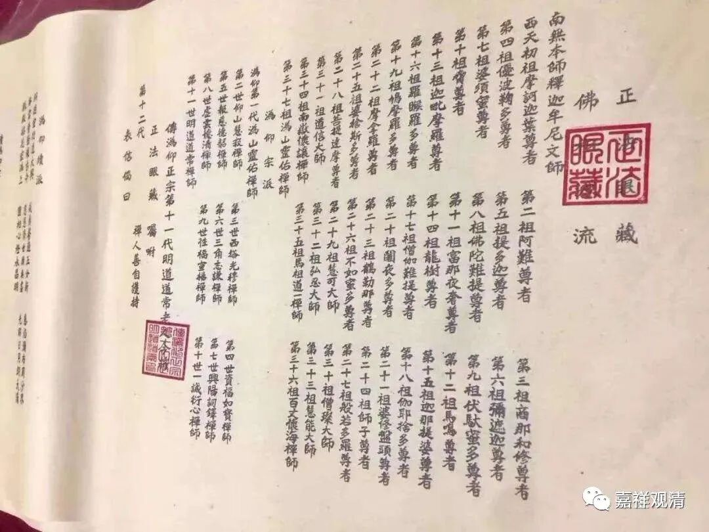
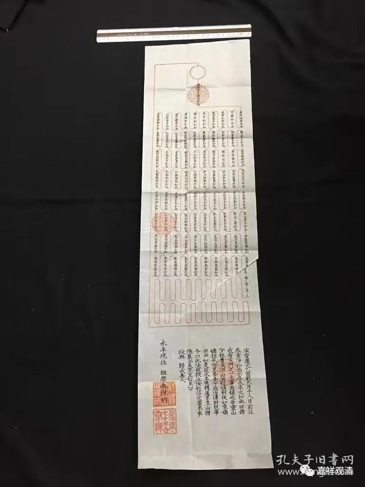
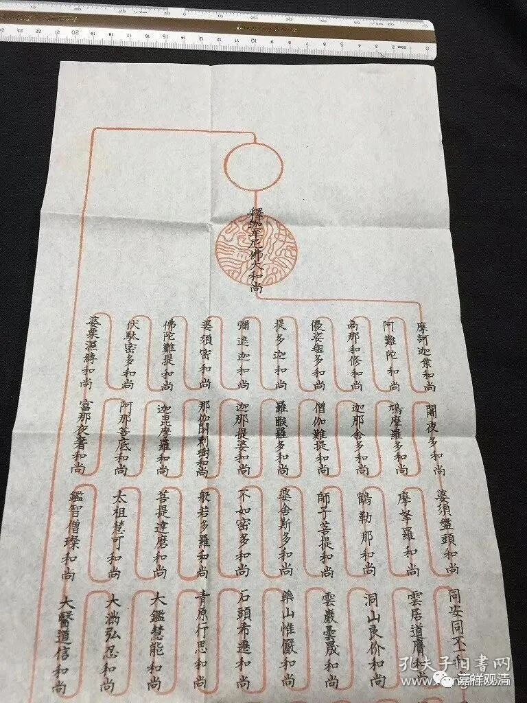

**《微课佛教史》198·2**

然后是阇夜多尊者第二十六，婆修盘头尊者第二十七——这“婆修盘头”就是婆薮磐豆，世亲菩萨啊！这下连唯识派的也出来了。摩拏罗尊者第二十八，鹤勒那尊者第二十九，师子比丘第三十。这个狮子比丘是有争议的，不过这个争议也可能是印顺法师太敏感了。舍那婆斯尊者（其他地方是婆舍斯多）第三十一，优婆觉尊者第三十二，僧伽罗尊者第三十三，须婆蜜多尊者第三十四，须婆蜜多可能是世友论师。

接下来是南天竺国王第三子菩提达摩尊者第三十五，这里菩提达摩祖师又变成王子了，恐怕有点问题。唐国僧慧可第二十六，那个时候已经到唐代了吗？应该没有。（慧可大约略早于三论宗的兴皇法朗，比吉藏还要长一辈，他应该还没有到唐代，是南北朝时期人。）僧璨第三十七，道信第三十八（道信略早于牛头法融，可以到初唐），弘忍第三十九，慧能自身于今受法第四十。

这是释迦牟尼佛算第七一直到慧能大师算第四十。慧能大师自报家门。

今天的禅宗里面有代表传承的法卷，这是什么呢？就是师父给你传法以后（也可以说同时），要给你一个证明，在师父给你的这个法卷上，最早可以从前面七个佛开始写，比如说前面庄严劫的第一个佛、第二个佛开始，到释迦牟尼佛，然后再一路写下来，最后写到你师父本人再传给你，谁谁谁受法于谁谁谁，再给你起个名字。比如说妙禅……哈哈，我自己的名字都忘了，不好意思哈。师父写一个法卷，再给你起一个这个法派的名字，就写下来，我手里也有一张。这个就是法卷传承。

网上早来的法卷

那么，法卷传承的情况现在日本也有，这个传承形式应该不单纯是明清时候出现的，应该比较早就出现了，用这种法卷的形式。我看到过一些日本的戒牒，他们的戒牒的传承方式也是这样的。比如说第一代从释迦牟尼佛开始，然后一代一代地传承下来，戒牒上的传承祖师的排列，用一条线把一代一代的祖师一个一个“串联”起来，中间填上人名。（前面那些祖师的名字是一次印刷的，后面空着，发证的时候填上后面最近几代的祖师。）

 

比如说一张条幅，前面都是印刷的，后面就有一些线串联起来，中间留一个空白。到了我师父的时候，就把他的名字填上去，然后我再把自己的名字填上去。这个就相当于证明我的戒律是从释迦牟尼佛那个时候一直传承到我这里的，然后我再给你传菩萨戒、五戒等等。你可以做成一个卷轴，也可以做成册页，如果比较小的话也可以单独折叠，并没有做成书的样子，然后可以带回家……

这个（上面两张）就是今天日本的戒牒的样子，有点像我们现在汉传的法卷。

