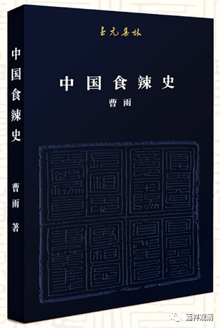

**《集论选讲》27·2**

还有“辛”到底是什么？“辛”这个字，我记得上《中医基础理论》的时候讲到过，因为中医里面也有“辛”，是吧？一般我们就讲它是辣，是吧？辣是属于“辛”的。

当时给我们上《中医基础理论》的那个老师，不记得当时是个讲师还是副教授了，一开始上课就觉得我对中医了解不少的，就“委任”我当课代表。那是因为1988年上海甲肝大爆发的时候，我得了甲肝就休学了，休学以后就自己看了很多中医书，慢慢地喜欢中医，所以上大学的时候就已经对中医有所了解。老师一看我这个情况，就“任命”为《中医基础理论》的课代表了。

后来老师讲到这个“辛”的时候就停下来不讲了，说：“你们回去想想这个辛，为什么属于金？它到底是怎么回事儿？”因为其它的几个味道还比较容易了解，比如说酸的属于肝、属于木；甜的属于土、属于脾胃，是吧？那么，这个“辛”属于“金”怎么理解呢？

我之前正好看到过这个内容，而且我看的还不是中医方面的，是《周易》方面的。大概是我初中三年级得甲肝的时候，经常去图书馆的阅览室看了很多这方面的书。所以上课的时候我就直接站起来回答老师的问题：“这个辛为什么和金有关呢？郭沫若说这个辛、辣，有点像刀割手的那种辣的感觉，所以金属就跟辛有关。”

那么，“辛”到底算不算味道呢？现在来说可能还是不能算味道（金属的味道也是不一样）。至于金属，那种味道我们尝过，是吧？那个味道到底什么样，我也讲不出来，但肯定不是辣的味道。辣的味道，是一种热，一种麻，是吧？以我们今天来看，它可能更接近于一种触觉，舌头感觉到的一种触觉。（现在我们受伤了还有用辣椒膏的嘛，那个“味道”……还有我们火锅吃得太辣回去腹泻，那啥地方也是“火辣辣地”……所以，其实，辣应该是触觉。）当然，阿毗达摩把它分类在味道当中，也无不可。

对了，现在有一本书其实挺好玩的，你们有兴趣的话去买一本也行，反正我是买了，放在我们宁波的图书馆里面。这本书叫《中国食辣史》——中国吃辣的历史。

中国吃辣的历史还真的和印度有关，而且也确实和味道有关。一方面人吃东西是要有调料的，是吧？而内地没有盐，因为盐在当时可以算是一种战略资源了，是国家垄断的资源。那么没味道怎么办呢？正好有辣椒进来，所以大家就在田头种点辣椒，用来调点味。为什么四川、贵州、云南喜欢吃辣，跟这个也有点关系——没有盐，用辣椒来凑合（据我们中医说，还有一个原因，因为当地太潮湿，需要用辣椒来除湿）。《中国食辣史》，你们有兴趣的话可以去买一本来看看。像前两天有兄弟讲的一样，有兴趣就去买，反正肯定不会因为买一本书而变穷了，不至于。

