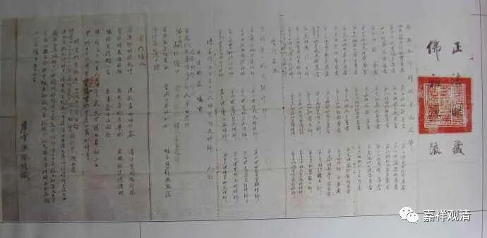

**《微课佛教史》198·3**

法卷有好多种写法，比较完整一点的写法是什么呢？是要从释迦牟尼佛那个时候，或者从庄严劫的佛开始，每个人后面都写一个偈子，中间有时候也会跳掉，但是尽量会写。到最后呢，你师父再写个颂子，到时候你自己还得写个颂子，但是也有些人就不写这个颂子。

我参加过三次法卷传承的仪式，有一次还是在大和尚边上当他的侍者来接法卷，他上面的这位老法师要唱一个颂子，他自己还得唱一个颂子。当然，今天这些传法的偈子，实际上都是提前写好的。比如说我是稍微有点水平的，我作为老和尚的秘书或者老和尚请我帮他担任秘书，第二天或者一个礼拜以后老和尚传要法传给七、八个人。我看到的情况就是，我要帮他们“肚撰”一些偈子出来，然后再就填上去。所以法卷上的这些颂子不见得是他们自己写的，如果是他们自己写的当然更好，但是现在这个事情更倾向于是一种仪式。（大家知道一下就可以了，别专门去外传，就是你们当作一个知识点去了解就可以了。）

那么，上面我就提到了所谓的“西天二十八祖”和“东土六祖”。其实固定为“西天二十八祖”的说法也是后来才出现的，好像主要是出自《传法正宗记》。都是有部的一些传承的祖师，然后中间再加上龙树菩萨等等，因为龙树菩萨是大乘“八宗共祖”，再加入了其他的一些说法……

所以，如果从历史的角度来看，这个传承表是没有什么意义的，或者说意义有限，也不能说完全没有意义。前面五位祖师大家都是这么说的，是吧？龙树菩萨，提婆菩萨和罗睺罗跋陀罗尊者，大家也是一样的，是吧？的确中间应该是有杜撰的成分，这个传承表很有可能是后期出现的。一般来说，我们从科学的角度来说，认为它是后期才出现的。（假如既要确定六祖大师不识字，同时还要认为他能记住这么多印度名字，这前后一代一代地还能无误地记下来——着多少觉得有点说不过去……）

反正造反的东西说多了，我也不当回事儿了。好吧，今天先讲到这里，谢谢大家！

