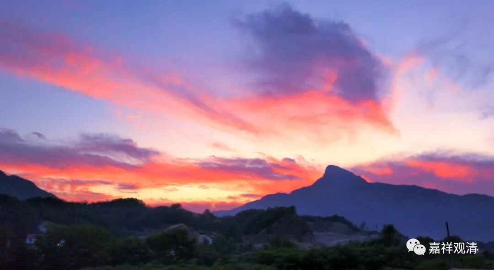

**《集论》选讲029·1**

好，我们继续《集论》。

我们昨天讲了“极略色”，也就是极微。这个极微又是什么呢？就是我们大家念的《金刚经》里面的微尘，这是旧的翻译，我们称之为旧译。旧译叫微尘，新译就叫极微。

鸠摩罗什法师和玄奘法师真的是中国佛经翻译当中两位划时代的人物啊！鸠摩罗什法师之前叫古译，鸠摩罗什法师开始叫旧译，玄奘法师以后叫新译。这两位人物就是两条线，在鸠摩罗什法师之前的叫古译，在玄奘法师以后的叫新译，在鸠摩罗什法师到玄奘法师之间的叫旧译。那么，“极微”的旧译就叫“微尘”。

关于极微的内容其实很多，也很复杂，我们上次多少讲了一点。在有部的背景下，对极微的发挥是比较多的。像后来佛教固定下来的地、水、火、风这种极微的说法是和印度的胜论派有关的，甚至在佛教界当中也有和数论派比较接近的观点，就是认为地、水、火、风不是究竟的极微，色、香、味、触才是最终的极微。《成实论》到底是不是这个意思我们另外再说，而最终在佛教界当中确实出现过这样两种对立的说法：一种说最小的极微就是地、水、火、风；另一种说最小的极微是色、香、味、触。

这两种说法的出典实际上可能是释迦牟尼佛讲的八微共成、八事共成，原先的意思或许简单可以理解为“所有的物质都有地、水、火、风，都有色、香、味、触”这样，就是往前追究的话可能是因为这个。但释迦牟尼佛本身没有发挥“极微说”，而后期在印度哲学当中胜论派发挥得比较多，那么就由于外道或者其他哲学流派在这些方面的理论发展，造成了佛教也必须有所回应，所以到后来佛教的极微说也越来越明显地表现出来了。当然，这也是当时内外学派竞争的一个产物。

我们大致上可以想象一下当时的情况，是在印度宗教林立的背景之下（印度的宗教实在太多了。），突然，胜论派当中就突出了这个“极微”的说法，那么在辩论的时候或者互相交战的时候，人家问到你极微，如果你没有相应的说法，你就比较容易先输一招。

我这是从印度宗教林立的背景之下去讲的。大家如果看《阿含经》，包括一些戒律的经典，可以发现当时宗教之间的战斗是长期出现的。我说的战斗是指论战，而且论战的输赢甚至直接关系到经济、关系到生存，论战输了的话，你的寺院、财产就没了。如果是婆罗门的话，那就是你的封地没了。如果是寺院的话，那你这个寺院的土地和建筑都没了。

