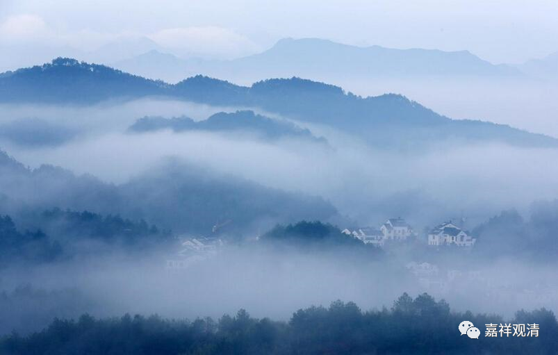

**《微课堂佛教史》202·1**

好，今天有点晚了。因为时间不够，我们就稍微讲一下菏泽神会大师。

在《宋高僧传》当中是有菏泽神会大师的传记的。菏泽，是指菏泽寺，山东好像有个地名就叫菏泽，这里是指菏泽寺。菏泽寺是在洛阳的，而菏泽神会大师是襄阳人。上次我们已经提到了，北宗的神秀大师后来也在洛阳讲经或者传法，住在荆州的玉泉山，那么他们两位大师在弘化地域上是有重合的。

传记上说菏泽神会大师小时候学过五经，又学过老庄，后来因为看《后汉书》知道了有佛教的说法。好像《后汉书》里面佛陀的教法和他的出家我觉得没有什么大的关系，后汉书没咋认真聊过佛教，也许是其他史书……反正有这样一个说法。

菏泽神会大师应该是很年轻就出家了，为什么呢？因为他去到曹溪慧能大师那里的时候，是以沙弥的身份去的，很年轻。然后呢，当时的他就有年轻人一贯的不靠谱的情况，比如说什么呢？说他第一次见到慧能大师的时候，慧能大师问他：“从何所来？”你从哪里来啊？

正常情况下我们应该怎么回答呢？就老老实实地回答吧，比如说“我从襄阳来”。神会小和尚说什么呢？他说：“无所从来。”（现实中我们确实也碰到过这样的人。）

慧能大师接着说“汝不归去？”你还不走？（或者“你去哪里呢？”）

他又回答：“一无所归。”

慧能大师就说“汝太茫茫。”这个“茫茫”就是茫茫大海的茫茫，实际上可以理解为是“莽莽”，就是太莽撞的意思，或者说，这种回答比较乱来。也是双关语——你来不知道，去也不知道，真是懵懂啊！……

然后神会小和尚仍然在回答：“身缘在路。”因为我还在路上，所以太莽莽也正常。小和尚的嘴特别利，但是这个时候真的不需要。初见善知识，应该老老实实有啥说啥。

慧能大师又说：“犹自未到。”他的意思是说你还早着呢，不是你现在说这个话的时候。同时也是双关语：在路上，还没到呢。

神会小和尚答曰：“今已得到且无滞留。”怎么说呢，又是牙尖嘴利——你还没到那个份儿上呢。他的意思就是说，我已经到曹溪了，到山上了，路上也没有什么停留，很顺利。这种情况如果被后期的禅宗师父看到了，肯定是打一顿，慧能禅师真的是人比较好。

我以前有个老师也发生过这种情况，他那个时候是佛学院的副院长。有个尼师过来，那个老师也是好好地问她，也就是刚才那种法：“你从哪里来啊？”回答：“无所从来。”“去哪里啊？”“一无所去。”那个老师直接说：“狂徒啊！”好像后来又说了一句什么，这个尼师又说：“我一丝也不挂。”老师又骂：“你个狂徒！”然后她就走了。后来她也觉得自己错了，就请居士过来向老师道歉。

江湖上通常有这种人的，有些新人为了表示自己是懂一点的，总会玩这些花招。但是说实话，这些花招对一般人你千万不要玩，因为你是新人，新人的话就应该藏拙，是吧？你什么地方不知道，你就应该把它藏起来。像这种对外表现为非常的嚣张，但实际上又不懂，这就不是藏拙，而是露腚了，可不是入定，呵呵。你们应该知道我说的是什么。

