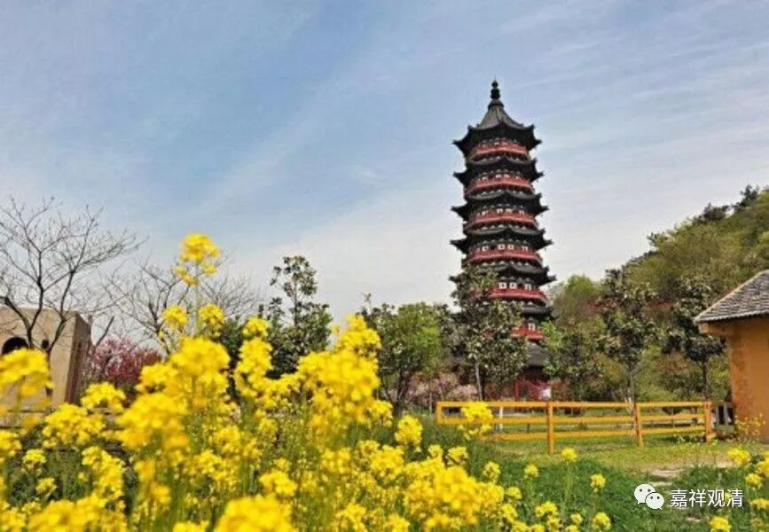

**《集论选讲》034·2**

我们举个禅宗的例子也是一样。比如说，禅宗认为“我们要学释迦牟尼佛的话，就要学他在菩提树下的那一招，学习其他的都是浪费。至于佛陀出来以后讲的东西，那都是对罗汉讲的，我们要成佛就应该学习菩提树下的那一招。”但是，如果你了解大乘佛教的话，实际上菩提树下那一招已经是化身了，释迦牟尼佛早就已经成佛，是佛的化身在菩提树下打坐是吧？他就是一个示现嘛。

所以，假如你认为禅宗是大乘佛教的话，他应该符合大乘的通说，但他们的理论背景，至少和这里的理论背景（大乘许菩提树下是佛陀的化身，之前早就成佛了），又是不合拍的。类似这种大小乘不分、混着讲的问题，在中国佛教史里边那些佛教教理学习不好的人当中长期存在。说他们“学习不好”可能有人不高兴，那就说“那些没有把佛教学通的人”吧，在他们当中，这种问题（不知道自己立场在哪里的情况）是常见的。

而且，这种情况在中国佛教的祖师当中也不少见。或者这么说吧，中国历史上的唐中期以后的佛教祖师们对佛教历史的了解相对来说比较欠缺一点，就是佛教的历史啊、演变啊等等。我经常讲的，有些是“哲学的高僧”，但不是“历史的高僧”（反之亦然，有些是“历史的高僧”而不是“哲学的高僧”）……但好像又不完全一样……

到了近、现代，一方面对佛教的典籍开展了文献化的整理，用各种现代治学的思路去整理了佛教的历史或者说佛教的思想史，另一方面，又引进了例如阿底侠尊者、宗喀巴大师的道次第系统。因此，对于我们今天的人来说，学习这些内容（整体的佛教框架）相对来说就要轻松得多。特别是佛教哲学史、佛教史、宗义这些方面的书籍出现以后，大的框架都已经确定下来，那么理解大小乘之间的区别相对来说就比较容易。而前人确实在历史这一方面是比较欠缺的，在民国以前基本上没有专门治学佛教史的，所以在这方面出现问题也可以说是很正常的。

我们把接下去那几个先讲完吧。

** 复有乐有味受、苦有味受、不苦不乐有味受；乐无味受、苦无味受、不苦不乐无味受。复有乐依耽嗜受、苦依耽嗜受、不苦不乐依耽嗜受；乐依出离受、苦依出离受、不苦不乐依出离受。**

** **

有“味”，有“耽嗜”，是吧？就是有所贪爱，有所系缚。系缚的反面就是“出离”，就是不想要，想离开。

这就是“受蕰”，我们轻松地讲完了。“受”其实没啥特别多讲的，就是领纳，简单地说就是感受，差不多可以这样理解。

今天我们就先讲到这里，谢谢大家！

