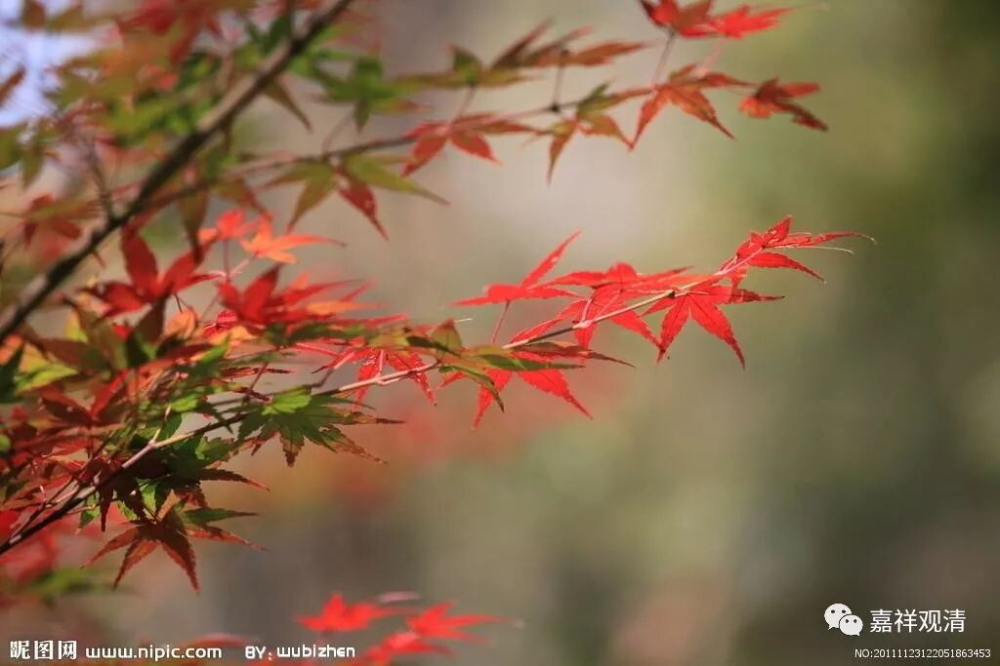

** 《微课堂佛教史》208·1**

好，我们继续科学地讲禅宗史。

我们现在讲到菏泽神会禅师。本来今天想讲永嘉玄觉禅师的，后来看了一下，关于菏泽神会禅师还有很多地方可以聊的，是足够让我们继续科学科学的。上次有讲到他的《坛语》——也就是《神会和尚语录》，就是大家都来提问题，神会和尚给予回答。我们上次讲了几件事情，现在再挑几个给大家看一看。

牛头山袁禅师，这位说不定是牛头法融禅师的门下，三论系统的？有点可能哦，因为这种说法确实在三论系当中吉藏大师说过。如果我们不带宗派观点地来看，吉藏大师可能曾经提到过这些事情，是稍微有点问题的，是什么呢？

“牛头山袁禅师问：佛性遍一切处否？”佛性是不是遍一切处啊？很多人都说佛性遍一切处，应该不是。三论系统在这方面是有两种说法的，实际上和菏泽神会禅师在这里的说法是比较一致的，但是三论系确实也有后面那种说法。我们先看下去。

“答曰：佛性遍一切有情，不遍一切无情。”回答得非常精确，这是对的。所以菏泽系到后来在圭峰宗密禅师的时候就和华严宗合流，是有原因的。这些说法实际上是和华严系有关的，华严系和北方的地论师以及摄论师都有一点关系，这里的这个说法其实就是华严（宗）系的标准答案。

那么，中国当时的佛教派别还有谁呢？就是天台系。不过，天台系不是这个说法。这里面其实还涉及到一个问题，就是菏泽神会大师是讲三乘的（当然他也讲最上乘）。这个问题我们先撇过去，继续往下看。

袁禅师继续提问。“问曰：先辈大德皆言道‘青青翠竹，尽是法【身】；郁郁黄花花（衍一花字），无非般若。’”哇！我以前刚开始学禅宗的时候，觉得非常美啊，然后就照背——待会我再讲这个故事。“今禅师何故言道‘佛性独遍一切有情，不遍一切无情’？”为什么你现在说“佛性独遍一切有情，不遍一切无情”呢？

其实这个问题并没有难倒对方。中国确实有这个习惯，就是用这种优美的文字当作一种例证，但这种文字、诗颂能够当作例证来反驳别人吗？其实一点都不能啊，对吧？这个“青青翠竹，尽是法身；郁郁黄花，无非般若”，你想说什么呢？但是中国人有时候真的会把格言当作真理，把诗当作真理。而且这个诗里面并没有谈到佛性的问题，是吧？

神会禅师怎么回答的呢？“答曰：岂将青青翠竹同于功德法身？岂将郁郁黄花等般若之智？”神会禅师说：怎么可以把它们对等起来呢？完全不是这样的！或者用更精确的说法：不是能够按照字面来直接解释的。待会我再来解释一下。“若青竹黄花同于法身般若者，如来于何经中，说与青竹黄花授菩提记？”释迦牟尼佛在哪部经里面说给这些翠竹、黄花授记什么时候成佛的？“若是将青竹黄花同于法身般若者，此即外道说也，”如果这么说的话，和外道说的是一样的。“何以故？《涅槃经》云：具有明文，无佛性者，所谓无情物是也。”《涅槃经》里面讲了，无佛性者为无情物也。

荷泽神会禅师在这里给的是标准答案。

