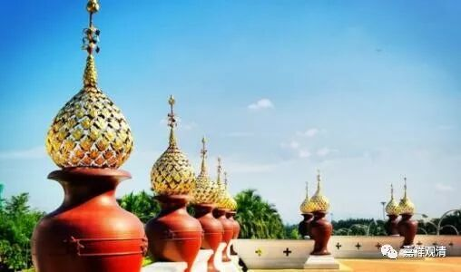

**《微课佛教史》208·2**

我们再把这段解释一下倒是可以的。首先，三论系的牛头袁法师他在说什么呢？实际上（很多人在这方面都会有问题的，为什么呢？）他是混淆了性空或者空性、法身、般若、佛性、法性这些词的范围。在般若经当中有时候会有这些词出现，我们如果看《肇论》的话，好像一开始就提到了，就是般若经当中提到的法性、法身、般若、性空、空性，法界、佛性，“一义耳”。所以很多人就会把它们完全等同起来，什么“青青翠竹，尽是法身，郁郁黄花，无非般若”。

应该说，这些词的意思是相同或者接近的，只是在某些情况下。比如说“法界”，（这个法界不是十八界当中的法界，这个法界是指空性。）其实这些词在这里都是在谈真如，都是在谈空性，包括真如本身也在里面，都是谈的空性。那么“法身”呢？在这里其实也是谈的空性，只是有时候用的词是“法身”。“般若”也是一样，它本来是智慧的意思，在这里是指“果般若”，还是指的空性。

但是如果你的经教实力不够，就会抓住这些表面的文字，就会觉得青青翠竹的法身就是佛的法身——不是！一定要帮他解说，那可以说，他真正的意思是，青青翠竹、郁郁黄花，不是说它就是法身，不是说它就是般若，而是说任何一个事物，它的背后都是真如，或者说背后的真如是一致的，这个说法本身是没有问题的。（其实就是说“一切法自性空”。）

如果你要认为这** 就是**佛性，那就不对了。这里“佛性”和“法性”等等也是一样，谈的是“真如”。但另一方面，它固然有真如的部分，但真正要给佛性下定义的话，它一定是在有情身上讲的，不能在无情身上讲的。当然，菏泽神会禅师也没说这个就是定义，如果单纯地说这个就是佛性的定义，应该也不精确。但是他很明确地说，佛性是在有情上讲的，而不是在无情上讲的。

我记得后来的圭峰宗密禅师和清凉澄观禅师都是这么一脉相承的，都是这么说的。清凉澄观禅师是要早一点哦，他专门在这方面（无情有性）进行了批评，批谁呢？实际上批的是天台（天台家和华严家在这上面的差别是很大的。今天好像天台和华严的差别已经不是很大了，但其实每家都有自己的家法，在这上面是互相不妥协的。）！清凉澄观大师在讲到佛性、法性的这一内容时，是和这里（荷泽神会）所讲的非常接近。当然，就经教的熟悉程度而言，清凉澄观大师要更胜一筹。

我选讲这段的原因是什么呢？是为了说明菏泽神会禅师在南宗的系统当中是属于具备一定经教学习背景的。虽然我们前面也已经分析过了，他的经教学习的背景可能并不是那么深厚，还是比较自由发挥的，但他毕竟还是具备一定经教学习背景的，而且和华严有相通之处。所以后期的菏泽宗——如果称他们为菏泽宗的话，就在圭峰宗密禅师那里和华严宗合流了。

很多人都会问一个问题——我看到后台也有人在问这个问题：为什么这些大师的名号都是四个字的？其实三个字也可以，四个字也可以。比如说临济义玄禅师，你也可以称他为临济玄禅师，把这个义字拿掉，单单称呼临济玄禅师也是可以的。前面两个字通常是他所在的地名，或者是他所在寺院的名称，后面则是他出家后常用的法名。

个别的情况也有，比如说马祖道一禅师，就用他在家的名字，是吧？再比如陈玄奘，也是用在家的陈姓。我以前曾经有过一次，把《大正藏》骂了一顿：“陈玄奘？怎么会是陈朝的玄奘呢？”后来才发觉：噢，不是陈朝的，是他在家的名字姓陈，所以叫陈玄奘。确实有这种做法，比如说邓隐峰禅师，清代上海嘉定还有一位解三通禅师，姓解……

所以三个字的法师名字也是有的，有些是用到他们在家的俗名，还有就是他出家的名字只用到后面一个字。

