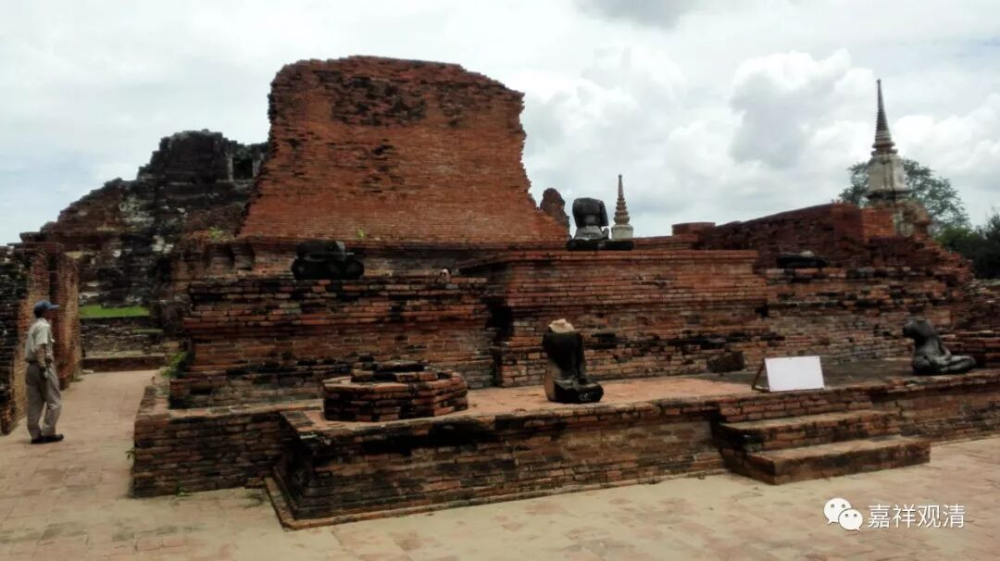

**《微课堂佛教史》209·1**

我刚刚学佛的时候看到这些禅宗故事当中的禅师名字，一开始不知道，还以为都是些日本人，感到很奇怪：“咦？怎么都是些日本人？”后来才发现不是日本人，全是中国人，至少绝大部分都是中国人。很可能是因为有些法名使用比较普遍，就用寺院的名称把他们区分开来。

另外，这也是中国的一个长期习惯。比如说，柳宗元的《柳河东集》，河东是一个地名，是吧？除了地名之外，还有什么？寺院的名字。比如说菏泽神会禅师，他最后在菏泽寺的时候比较有名，就叫菏泽神会。但是，也有可能是早期的寺院，假如说他的僧籍在当阳山玉泉寺，他也可以叫玉泉神会禅师，这两个可能都是通用的，而后期叫菏泽神会禅师。

所以有时候你去查一位禅师，可能会出现好几个名字，有几个非常接近的名字，是要注意的。

还有的时候，要注意到一些通假字，比如说“惠”（贤惠的惠）和“慧”（智慧的慧）。也有不同的名字会互相串用的，举个例子，僧朗禅师有时候又被称为道朗禅师，这类名字不同但很有可能是同一个人。这是顺带讲到的，大家要稍微注意点。

后面我们再讲几段《神会语录》中的问答，因为我发现这里有几则是比较重要的。比如这里有一段是比较重要的，虽然前面还有几段，但我觉得再讲就有点多了，所以就单讲比较重要的这一段。

崇远法师在和菏泽神会禅师辩论的时候专门问道：“你来定是非——定南北宗的是非，你是不是因为名利呢？”神会禅师就回答说：“不是因为名利。”然后又问他：“那你们的传承是什么？”

这里我们可以看一下，早期的菏泽神会禅师说的传承，和现在《坛经》当中的说法是完全不一样的。我们也可以理解，现在的《坛经》当中所说的二十八代的传承，至少要晚于菏泽神会禅师。菏泽神会禅师怎么说的呢？

“和尚曰：‘菩提达摩西国承僧伽罗叉”，就是说菩提达摩的师父是僧伽罗叉，“僧伽罗叉承须婆蜜”，僧伽罗叉的师父是须婆蜜，实际上可能是婆须蜜，写成须婆蜜，“须婆蜜承优婆崛”，这应该是优波崛多，“优婆崛承舍那婆斯，舍那婆斯承末田地，末田地承阿难，阿难承迦叶，迦叶承如来付。”

从迦叶到阿难，到末田地，到舍那婆斯，到优波崛多，这是前面的五代，是最早佛教的五代传承，如果我没记错的话，应该是。然后再加上婆须蜜，他也是有部的，然后僧伽罗叉，再到菩提达摩。你们看，在印度菩提达摩是第几代？第八代！中间就这么点人。

也就是说，在菏泽神会禅师的晚年，他所说的禅宗的源流当中，西国只有八代。而且这八代当中的前面五代是大家众所周知的，中间只加了三代，这当中的空白很多的。所以后来禅宗的人就觉得这个不对，要加传承，但是加谁又不知道，怎么办呢？就把有部的传承拿过来借用了。

