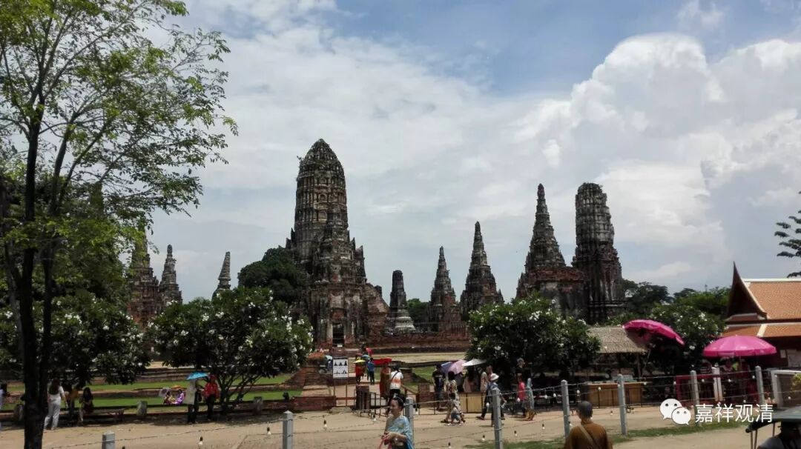

**《微课佛教史》209·2**

然后从这里接下去，从达摩祖师开始，再是慧可禅师。在另外一本书当中就说了，慧可、僧璨、道信、弘忍、慧能——这是汉地的六代传承。那么，西国的八代加汉地的六代——汉地这六代实际上只算汉人的话是五代，是吧？因为达摩两边都占着，是吧？所以八加五，几代？十三代！在菏泽神会和山东崇远两位禅师进行辩论的时候，当时禅宗的传承谱系只有十三代。这里面还提到了一个事情，就是传衣传法的问题，说他们是有传衣的——就是有袈裟。这个衣应该是指达摩的衣。

这一段是在敦煌本当中的，叫《答崇远法师问》，也有认为这就是《南宗定是非论》当中的一篇。这后面在强调什么呢？非常地强调《金刚般若波罗蜜经》，用了不小的篇幅来号召大家念诵《金刚般若波罗蜜经》。

这里面其实还有一段比较震惊的——不过对于一般的禅宗来说，都已经不算震惊。这是在胡适先生校编的《神会和尚遗集》里面的，他们辩论到这里的时候，问题就大了。崇远法师就问菏泽神会禅师：“你现在辩南北宗定是非，那我来问你，三宝四果当中，你的位置在哪里？”就像天台宗的智者大师，讲他自己属于加行位的十信位当中的哪一个，具体我记不清了。崇远法师就问神会禅师的位置在哪里，菏泽神会禅师怎么回答呢？“在满足十地位。”十地满足了，不就是佛吗？

这一段的后面就缺掉了，没了。当时崇远法师就回怼的，回怼的这部分还在，说：“初地菩萨分身百佛世界，二地菩萨分身千佛世界……”就是初地菩萨不作意可以分百化身，有百世界，刹那得百法明门……二地菩萨是以千计。崇远法师说：“你已既然已经成佛了，那你给我们变一个呗？”这个后面没有回答——也不叫没有回答，后面敦煌的纸就没了，所以这一段没了。我也不知道当时神会大师是怎么回答的。

今天先讲到这里，明天再讲永嘉玄觉禅师吧。大家可以想想看，你们如果有本事的话，要怎么帮菏泽神会禅师回答。

我再补充一个我自己的故事。我以前读大学的时候，一次在居士林听课，就是上海的居士林。上面有一个人在讲经，讲着讲着就说：“你们知道不知道？你就是佛！”下面其他人的反应怎么样我已经忘了，但是把我吓了一跳，从头到脚，浑身汗毛全部竖起来了，吓了一大跳。也许是我不肯承当，但我实在是听不下去了。虽然当时也学了不少禅宗，后来就跑了，上面说的人是谁我也不知道了。

禅宗到最后的末流就变成“你就是佛！你敢不敢承认”这样一个问题了。哎！这个真是……另外，“青青翠竹尽是真如，郁郁黄花无非般若”，这个我也碰到过。跟唐老学习的时候，每天早上五、六点钟就跟他在河边散步，然后大家都要写诗，有问题的话这个时候就可以问。

有人就问唐老：“青青翠竹尽是真如，郁郁黄花无非般若，这个怎么回答？”唐老还不等他再多说什么，直接就说：“放屁放屁（四川话的口音为‘防皮防皮’）！这个胡说八道。”唐老的口头禅就是放屁——放狗屁，放猫屁，放马屁，放驴屁，放耗子屁。他是不承认无情有佛性等等这种说法。

好，今天先到这里，谢谢大家！

