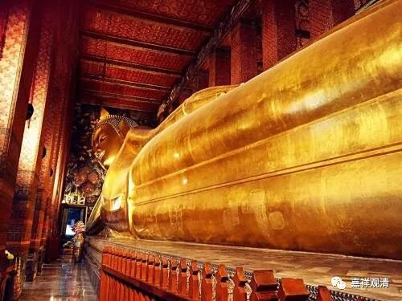

**《集论》选讲038·1**

好，我们继续《集论》。

“思”和“作意”讲完了，接下去是“触”。

“触、作意、受、想、思”是五遍行。五遍行当中，“受”和“想”是单独的两个蕴，即“受蕴”和“想蕴”。而“行蕴”则包括了很多的内容。这三个再加上“触”和“作意”，就是五遍行。

我们先讲“触”。

** 触者，依三和合，诸根变异分别为体，受所依为业。**谓识生时，所依诸根随顺生起苦乐等受变异行相，随此行相，分别触生。

“触者”，这是心所——就是心理活动当中的“触”，不是前面物质的那个“触”。“依三和合，诸根变异分别为体，受所依为业”，这个“体”就是它的自性或者说是自相。应该说，有时候“自性”和“自相”这俩词是一样的意思，但也有时候是不一样的，那么在这里是一样的意思，用“自性”、“自相”都可以。“三和合”就是根、尘、识三者和合，比如说根是眼根，尘就是色境，识就是眼识，放在一起。

“诸根变异、分别为体”，为什么要这么说（诸根变异、分别……）呢？因为其他宗派当中有认为“触”是假法的，三和合就是“触”，而唯识也好，有部也好，则认为“触”是个实法。实法就是一个实有的法，是有独立自体的，有自性的。“诸根变异分别为体”就是为了说明“触”不仅仅是根、尘、识的和合就完了，而且在“根”上要有一些“变异”的。比如说，眼根、色尘和眼识合在一起能够见色，要生起“触”的时候，在眼根上要有一点点的变化，所以这里说“诸根变异、分别为体”。其他宗派认为“触”就是三和合，就是个假法，那就没有“诸根变异分别为体”这部分的说法了。

“受所依为业”，就是指在“触”之上再产生其他的“受”，这是“触”的作用。

这就是“作意、触、受、想、思”，“五遍行”讲完了，接下去是五别境——“欲、胜解、念、定、慧”。

