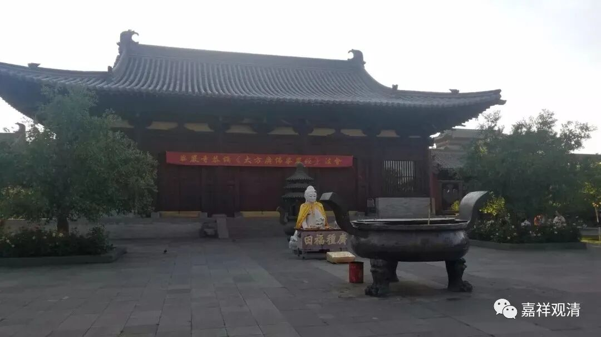

**《微课佛教史》211·2**

永嘉玄觉禅师又说：“无生岂有意耶？”

文字上说，六祖大师又问出一个问题：“无意谁当分别？”如果意没有实体的话，那么谁来分别呢？这个“谁当分别”，并不是说“由谁来分别”的意思，应该理解为：如果没有意的话，那怎么能够被分别呢？怎么能够被认识呢？

永嘉玄觉禅师答曰：“分别亦非意。”这个意思是说：即使认识与被认识是存在的，但并不能由此而承认能认识的“意”是实有的——应该这么来理解“分别亦非意”。很多人把这里的意思理解为分别也不要了等等，不是这个意思。这个“分别”是能认识和所认识。

六祖慧能大师赞叹说：“善哉！善哉！”不错！不错！你学得不错！“少留一宿。”刚才讲了，让他不要走得太快，然后就邀请他再待一天，“少留一宿”。今天太晚了，现在下山不方便啦，明天再走吧……

于是，永嘉玄觉禅师就待了一天再走。“时谓一宿觉矣。” 前面我们留了一个伏笔，当时称他为什么呢？“一宿觉”。

“一宿[ sù ]觉[ jué ]”是什么意思呢？永嘉玄觉禅师在来拜见六祖大师之前就已经学得不错，过来只是为了被印证、被勘验一下的。“宿觉”，说明他不是到这里才学的，以前就已经学得不错了。

“一宿[ xiǔ ]觉[ jiào ]”，就是到这里待了一晚上，睡了一宿。“只睡了一晚上”

永嘉玄觉大师其实年纪很轻，他圆寂的时候也就四十几岁。当然，在那个时代四十几岁也不算夭折，那时候平均寿命也就三十多岁。他后来回了温江，留下了一些传世的文字，还有一些其他的故事——那些神奇的故事我们就不讲了。大家可以看到有《玄觉永嘉集》传世，还有一篇《永嘉证道歌》，比较朗朗上口的，大家有兴趣的话，可以去看一看。

我来念几句《永嘉证道歌》吧，后人比较喜欢学这个，朗朗上口。《永嘉证道歌》一开头的地方：

“君不见，绝学无为闲道人，不除妄想不求真，无明实性即佛性，幻化空身即法身……”

再比如后面这一段：

“无罪福，无损益，寂灭性中莫问觅，比来尘镜未曾磨，今日分明须剖析……”

永嘉玄觉禅师的弟子也不少，但是由于他的寿命不太长，所以他的门下应该是没有传播得很远。天台宗是把永嘉玄觉禅师当作正宗的祖师，禅宗里面基本上也把他当作正宗的祖师。（实际上说起来，他在禅宗里面并不算，毕竟没有经历长期的教学，那就难谈得上继承与发扬……嗯，禅宗里面怎么算我们就不管了，反正现在禅宗里面也没有他长程的弟子系统。）

好，永嘉玄觉禅师的故事差不多就这样，今天先到这里，谢谢大家！

