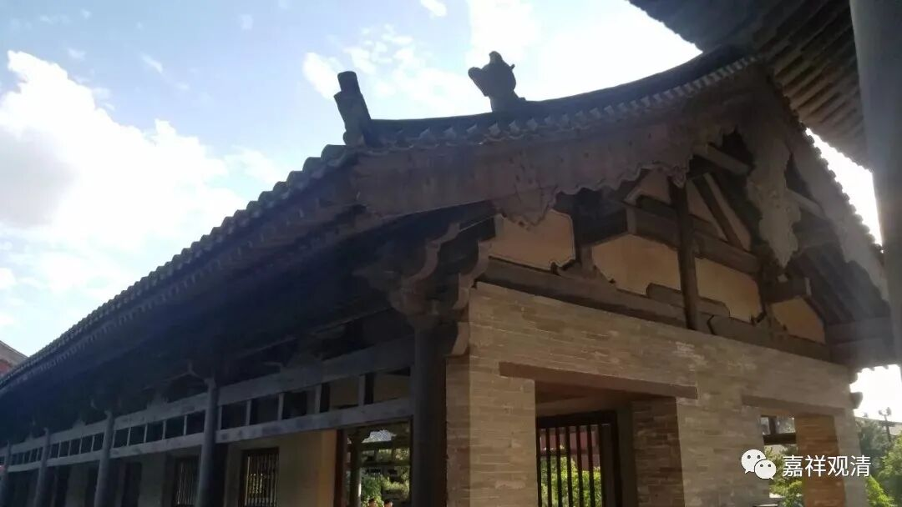

**《集论》选讲039·1**

好，我们继续讲《集论》。

《集论》讲到这里，就出现了我之前讲过的一个情况，由于我不能够看到大家的脸，也不知道大家对我现在讲《集论》的反应如何，不知道哪种讲课方式是适合大家的，所以我一讲就讲到了自己喜欢的方向去了。大家如果有什么想法的话，正面的可以反馈给我，负面的可以不反馈——哈哈哈，也可以反馈一下，没问题的。

我的确有想到这个问题：很多人对佛教是不是需要了解到这么深的程度呢？但是我自己讲着讲着，就往自己喜欢讲的方面去了。讲课最轻松的就是大家水平差不多，这样讲起来很舒服。像现在这样网络上讲课其实很困难，水平相差比较多，有些人啥都不懂就在听了，提出来的问题……也有人的问题，呵呵，不是很想回答。当然，大家也不要因为我这句话就被吓到了，你问就问呗……最多我不回答你，是吧？哈哈哈哈……也算是开个玩笑。

再回到《集论》上来。我前面已经要求过大家，至少要把《百法明门论》的那个图背下来。现在又来了很多新人，不知道有没有背过，如果没背的话赶快去补，否则这个课你听了也是白听，没有整体的印象。

不过我也不知道有多少人在认真听，这里报名是有292人，我估计认真听的人一半人都没有。包括微信公众号的推送点击量也很少，有一段时间上过高峰——有200多，现在又降下来了，说明我们这里能有一半人听就已经很不错了。（一般点击量也就一两百……）

好，现在《集论》已经讲到了“行蕴”，实际上这里讲的已经不再是“蕴界处”的用法了，它应该用的是类似于《百法》或者“五位七十五法”这样的框架，等于是把“五位百法”或者“五位七十五法”这样的框架硬往“五蕴”里面凑。实际上这是两个不同的体系，“蕴界处”的体系和“五位百法”或者“五位七十五法”其实不完全一样，不过硬凑倒也不是不可以。就是你不能说它们不是一件事，但是至少一开始的时候它们不是放在一起讲的，而现在我们掺和在一起讲，或者画在一个表格内，它只是一种教学上的正确，未必是当时释迦牟尼佛的原意。可能释迦牟尼佛根本就没有想过要讲这个事情，或者想让我们把这个表格画出来，但是就我们现在的教学而言，画这样一个表格来学习会比较方便。

那么，“五位七十五法”或者“五位百法”等等也是一个新的体系，等于我们有四个体系来讲一切法，也就是对事物有四种分类法。一个就是“五蕴”，但是“五蕴”里面少了无为法，对吧？一个是“十二处”，一个是“十八界”。（其实说“六界”也可以的——“地、水、火、风、空、识”，也是可以的，但是后来“六界”就很少讲了。）再一种分类就是“五位”——“五位百法”或者“五位七十五法”等等，都可以。

前面这三种是释迦牟尼佛自己讲的，（或者再加上一个“六界”，）都是释迦牟尼佛自己讲过的。后面的“五位百法”或者“五位七十五法”，其实不是释迦牟尼佛亲自讲的。（后期也有一些经典当中出现了，这个就另外再说，不展开了。）从历史的严格意义上来说，“五位百法”或者“五位七十五法”很明显是在部派佛教的阶段被总结出来的，然后大家就发现这种“五位”的分类法特别好，所以就被广泛采纳了。

“五位”——“色法、心法、心所法、心不相应行法和无为法”，这个大家怎么也得知道啊！越到后期，大家越觉得这个“五位”的分法特别顺，所以虽然是有部发明了“五位”的说法，实际上后来各个宗派都在用，特别是北传的佛教，基本上就按照“五位”的框架在谈。其实也可以说，梵语佛教都很习惯地使用“五位”来谈。

