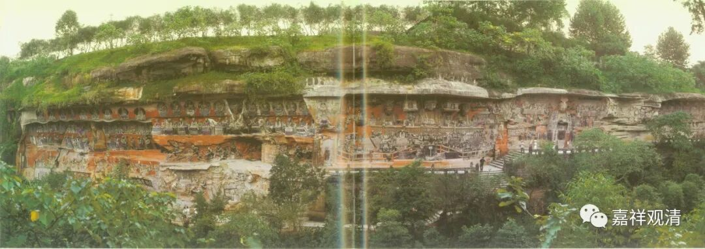

**《微课堂佛教史》212·1**

好，我们继续科学地讲佛教史。

我们已经讲到了六祖慧能大师的弟子们，慧能大师出名的弟子挺多的，前面已经讲过一些，我们继续一个一个的讲。之前讲了两个了，是吧？菏泽神会禅师和永嘉玄觉禅师。天台宗也是把永嘉玄觉禅师当作自己的嫡传——应该算嫡传吧，实际上也确实是这样，永嘉玄觉禅师是在天台宗学习的，之后过来禅宗六祖大师这里就待了一天，又被称为一宿觉。

今天我们再稍微讲一下青原行思禅师。有一种说法，慧能大师门下有五位最重要的弟子——青原行思禅师、南岳怀让禅师、菏泽神会禅师、永嘉玄觉禅师和南阳慧忠禅师。实际对于后世来说，最重要的是其中的两位——一位是青原行思禅师，一位是南岳怀让禅师。

青原行思禅师门下主要出了石头希迁禅师，南岳怀让禅师门下主要出了马祖道一禅师。禅宗后来的五家七宗，主要就是他们两位的弟子传下去的。菏泽神会禅师的门下后来出了圭峰宗密禅师，但是再往后也没什么人了，很快这一支的传承就结束了。

南阳慧忠禅师也很重要，为什么呢？因为他曾经当过国师，对于禅宗的发展来说呢，就等于“朝中有人好办事”。他在朝廷里做了内道场的首座，地位很高，和法琳法师是一样的。（但是法琳法师这个人我们没有谈过，因为我们谈的都是宗教人士，而他是属于护教的人物。）当然，法琳法师也是大师级的人物，水平也很高，我们看看以后有机会再谈一谈吧。

今天先讲青原行思禅师。其实，主要因为青原行思禅师的弟子是石头希迁禅师，我们才把他带出来讲的。刚才也讲了嘛，对于禅宗的后期来说，比较重要的是青原行思禅师和南岳怀让禅师这两位。如果看禅宗前期的话，这两位禅师的地位似乎并不凸显。在上面谈到的六祖大师这五位弟子当中，早期最重要的应该是菏泽神会禅师（为南宗禅争地位），另外两位呢，永嘉玄觉禅师是在地方上——在浙江比较有名，而南阳慧忠国师则是在社会的高层比较有名。

到了后来呢，主要是看谁的弟子能够跟得上，法脉能够绵长……那么这两位——青原行思禅师和南岳怀让禅师，法脉绵长（我们现在也就这样泛泛地说过去了）。到了禅宗的后期，其实是有一点比较麻烦的事情，在禅宗内部也是要争论的，主要就是关于传承的问题。拿中国人来说，就是认祖宗的问题——不能上个坟，磕错头、烧错香……

