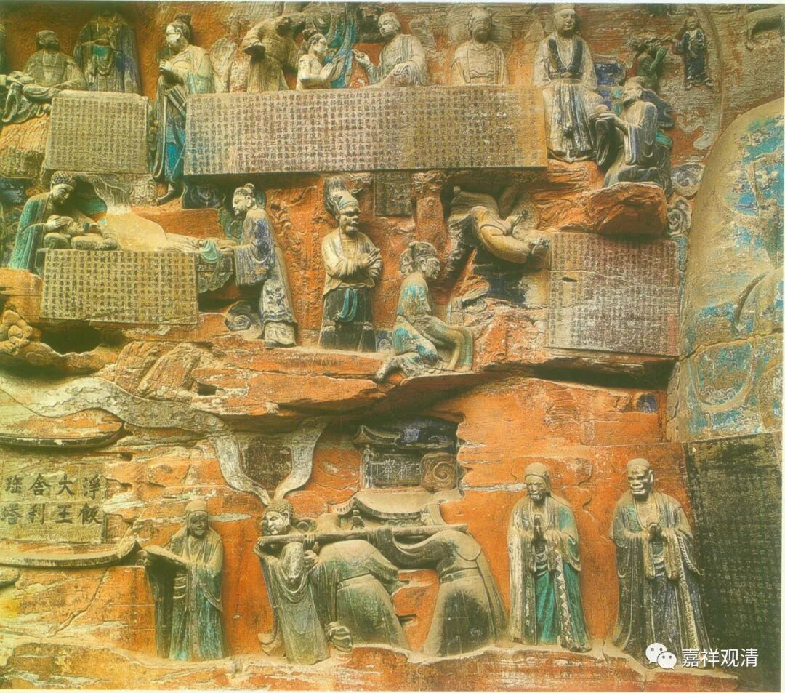

**《集论选讲》038·2**

早期佛教的各个宗派其实都在类似地尝试对事物进行新的分类，各种分法也都有点道理，问题就是——“谁活到最后，谁笑得最好”。那有部活到了最后，所以最后大家就觉得有部的这个“五位”说法是最好的，而其他的就被误解、被污名、被抛弃。我个人觉得大概的次序是这样的——被误解、被污名、被抛弃。

我经常会讲到的一个，就是犊子部的“不可说法”。其实犊子部的“不可说法”就是这样，首先被误解，然后被污名，最后被抛弃。我认为犊子部的“不可说法”和有部的“心不相应行法”的分类几乎是没有差别的，但是由于大家误解了，就把犊子部的这个说法骂得一塌糊涂，最后还说它是“佛门里的外道”，就把它扔掉了。呵呵，待遇差别非常大啊！

这个“不可说法”实际上在《大般若经》当中都有的，叫“不可说蕴”。“蕴”就是一类，对吧？我们现在看来，就是一类一类的，比如说“五位百法”，这个“五位”不也是一类一类的吗？

那么，“不可说法”是怎么出现的呢？在佛教的发展过程当中，就发现有一类法，有一类事物，我们进行分类的时候很难把它们归类。比如说时间、空间这一类的法，这是其他宗教也谈到的哲学上重要的概念，它们（时间、空间）到底应该归在哪里呢？此外还有寿命等等，这些东西到底怎么算？怎么归类？

中观派（初期）有一段时间也遇到类似的问题，就是有一类法要怎么去谈、怎么去归类。比如说时间、空间，它们是不是“心法”呢？不可能是“心法”。是不是“色法”呢？不可能是“色法”。是不是“心所法”呢？也不可能是“心所法”。是不是“无为法”呢？说起来应该不能算是“无为法”的，那它们到底是什么？这就很难去进行分类。

所以呢，中观派曾经一度——至少在《大智度论》当中提到了，就直接把时间、空间这类算作“无为法”。但实际上不是真正地要说它们是“无为法”，主要是因为前面四个放不进去。

于是呢，犊子部就想到了发明一个名称叫“不可说”，就是这些东西既然不能说是“心法、色法、心所法、无为法”，那么我就把它们归一个类，给它们取个名字叫“不可说”，区别于另外四个。这一类是什么呢？就是“不可说”，就是你不能记别，就像“无记”一样，到底是哪一种？是善，还是恶？都不是，那么就把它单独分一类。

其实这种“不可说蕴”，以我们今天来讲，就是一类概念的法，它们不能说是另外四个当中的任何一个，就把它们放在“不可说蕴”里面。比如说“补特伽罗”——就是轮回的主体，犊子部认为这个“补特伽罗”就属于“不可说”。但是后来被别人污名化了，他们自己也奋起反击，从而导致自己越来越极端，真的把这个“非即蕴非离蕴的我”在理论上变成了一种特别实有的东西。这就是被误解、被污名化以后出现的问题。

