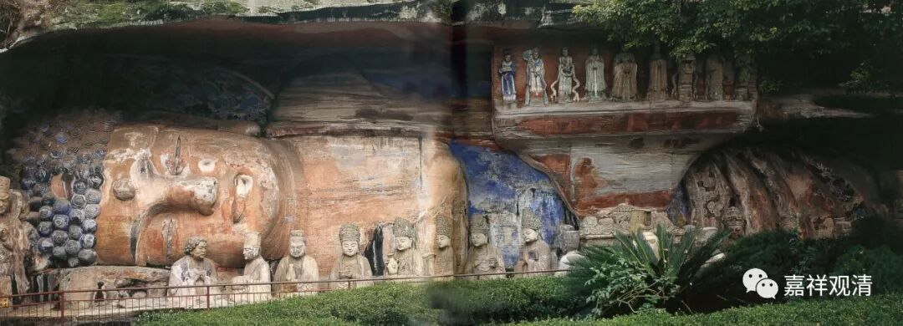

**《微课佛教史》212·2**

**
**

在禅宗的五家七宗当中，曹洞宗很明显是由青原行思禅师门下分派出来的，临济宗的传承脉络也很清晰，是从南岳怀让禅师到马祖道一禅师，然后是百丈怀海禅师，再是黄檗希运禅师，再到临济义玄禅师，这是非常明确的。

后来就出现了一位天皇道悟禅师，在他的门下分出了两派还是三派。那么，就出现了一个问题：天皇道悟禅师到底是属于石头系的还是马祖系的呢？于是，就出现了禅宗后来的争地位的情况。

比如说这两位禅师的门下，一位门下有一个分支，另一个门下有四个分支，如果是一个门下有三个，另一个有两个，那三个两个就无所谓，但如果是一个和四个，差别就比较大。有些分派就有点不太满意，就要为自己的祖师争地位——其实没有什么特别的意义。

不过在禅宗当中，那些争地位的事情还是没少做，所以后来就出现了两个人——一个是天皇道悟禅师，另一个是天王道悟禅师。反正就变成了有两个人，大家如果有兴趣的话可以去考证一下，好像有人专门考证过的，我们也就不考证了，就一个一个地讲下来就是了。

现在先讲青原行思禅师。青原行思禅师是江西吉安人，吉安那个地方离广东比较近，距离大庾岭、韶关也很近的，所以他就去了六祖大师那里学习。在后期的时候，青原行思禅师在六祖大师的寺院里是首座，地位很高的。青原行思禅师俗家姓刘，有一种说法说他是某一位长沙王的后人，姓刘嘛。大家大概也听说过，前几年好像在南昌挖出了什么海昏侯的墓葬。

青原行思禅师很早就出家了，但是他的生卒年份其实不是很清楚，有说是从公元671年到公元740年的，这个说法不是很确定的，我也就那么泛泛一说，因为这种说法使用的史料是一些后期寺院的记载。大家要知道，即使是挖掘出来的，如果仅仅是一些后期的寺院记载，也不见得能够当真的。如果在早期的时候没有确定生卒年份的话，后面新增的资料不见得可以采信。当然，大家如果有兴趣的话，可以自己慢慢地去考证，这里我就不再多说了。

**
**