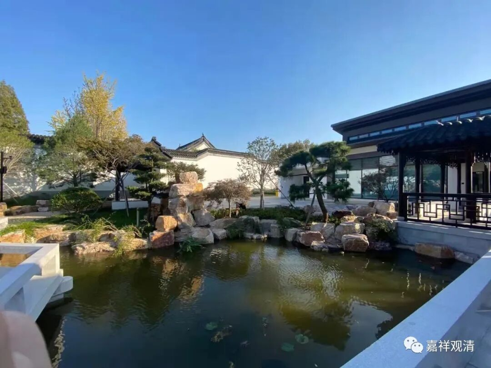

**《微课佛教史》213·2**

后面的那一段机智问答是青原行思禅师和石头希迁禅师之间的故事，我们就放在讲石头希迁禅师的时候再讲了。

这里还有一段，是提到了关于传法传衣的问题，以前是传衣的时候传法，相当于达摩祖师的袈裟是在曹溪的。六祖大师说，将来我传了法就不传衣了，袈裟就留下来镇山门。所以青原行思禅师就没有得到袈裟，然后他出去开法。

我觉得还有一种可能性，这个故事是后期传说出来的。因为青原行思禅师虽然在教导徒弟，但是他手上没有达摩祖师的袈裟，这说起来不太好听。禅宗里面有些人会说：“其他人有袈裟的，你没有！”就是他并没有达摩祖师的袈裟。于是，青原行思大师的传记里就出现了“只要得到法的就行”，乃至后来荷泽系说的“只要得到《坛经》就行”（把他《坛经》传宗），对吧？这一点很有趣。

其实等到实力强了，袈裟、《坛经》就都不重要了——这个世界，实力最重要，有人，有庙，就算赢了。你看现在的禅门谁还说“我有达摩袈裟”“我有《六祖坛经》”……这些都不重要了。

但在当年就很重要了，就像三国时期，不管是刘备手上的“衣带诏”还是袁术手里的“传国玉玺”，都是想要“有个说法”，至于实力派曹操呢，人家说了，如果没有我，“不知道几个称王几个称霸”……

单纯的青原行思禅师的传记故事不多，内容也不多，大概就这些。即使这些内容，其实很多内容也是后期禅宗“层垒”出来的，也就是到了宋代以后，才整理出现了他的故事，早期关于他的故事非常少。

后期禅宗的传记大概主要都是以这种形式出现的，就是以机智问答的记录为主，而不是以前佛教史书那种讲“他在哪里待过，讲过什么法”等等的写作方式。从此，中国佛教，特别是禅宗的史书，从“《史记》体”变成了“《世说新语》体”……《史记》的庙堂体很难写，方言土语的机智问答就好写多了。

好，关于青原行思禅师我们就讲到这里，谢谢大家！

