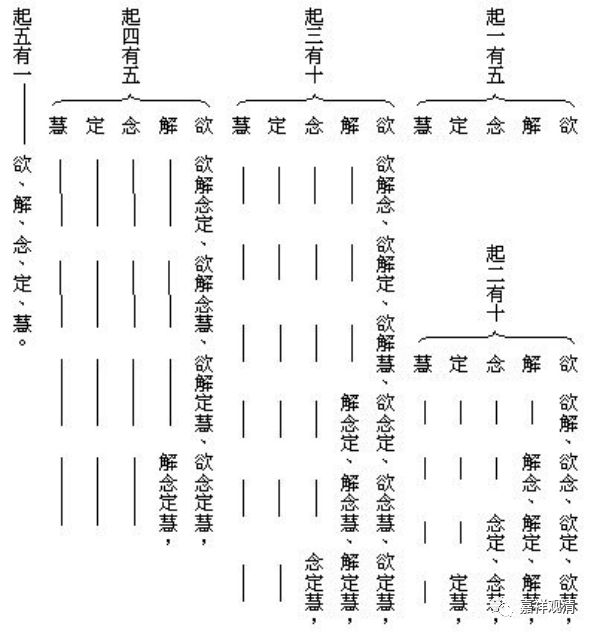

**《集论选讲》040·2**

即便是无著论师的时候已经把“五遍行”和“五别境”定型下来（这其中“遍行”的问题不大），但是对“别境”的理解，一直到安慧论师的时期（甚至是安慧论师本人）以及安慧论师之后再晚一点的时期，都是存在争论的。争论什么呢？这“别境”之“五”，到底是1、同时生起的，还是2、各别生起的，还是3、可以和其它一起生起的？大概有这样三种说法。

护法论师认为，“别境”是可以单独生起的，也可以两个两个，三个三个，四个四个，或者五个一起生起。

安慧论师不是这样认为的，在他的前后期有两种不同的说法（当然，这不仅仅是安慧论师一个人，还包括德慧论师等等）。一种说法是什么呢？就是这五个必然不能同时生起，只能一个一个地生起，因为这五个都是差别境，前面三个的“境”都不一样（我们之前讲到过了），最后两个“定、慧”的“境”都是于“所观境”。

为什么说一定不能同时生起呢？大家还记得我们前面讲的定义的时候，出现了什么？它们的所缘境是不一样的，对吧？“欲、胜解、念、定、慧”，每一个的所缘境都不一样，每个解释的第一个词就是讲所缘境，大家可以再看一下。只有后面两个“定”和“慧”，它们的境是一样的，都是“于所观境”。前面的境呢，都是不一样的。所以，唯识派的大论师——安慧论师，就有一种说法，认为这五个必然不能同时生起。有没有道理？

我们看，比如说“欲”，是“于所乐事”，是吧？“胜解”呢？是“于决定事”。“念”呢？是“于串习事”，或者是“于曾习事”，对吧？那么“定”和“慧”呢？就是“于所观事”，是吧？后面这两个（定慧的境）是一致的。

很可能最初说“这五个不能同时生起”，就是因为它们的境不一样。可能后来又看到后面两个都是“于所观事”，那能不能同时生起呢？就说可以。既然“所观事”是一样的，那后两个就可以同时生起喽。

所以，安慧论师又有一个说法，说是这五个需要同时生起。如果说需要同时生起，这是站在什么角度讲的呢？在传说当中，《俱舍论》是安慧论师的研究强项，如果按照《俱舍论》的说法，“遍行”和“别境”作为“十大地法”，就一定要同时生起的，这十个是一起生起的。

那么我们就可以理解，为什么安慧论师有时候会讲五个“别境”必须要同时生起。因为如果是“十大地法”的，它们就必须要同时生起。为什么他又说不能同时生起？——比如说安慧论师在注解《集论》的时候。

很明显的，《集论》当中后面五个法的所缘境是不一样，五个“别境”的所缘境不一样，对吧？分别是“所乐事”、“决定事”，“曾习事”或“串习事”，最后两个都是“所观事”。既然对象不一样，那心也不一样。所以也是有原因的，也有道理。

但是，玄奘大师的师公——护法论师最后说什么呢？“别境”是可以单独生起的，也可以两个两个生起，也可以三个三个、四个四个都可以，五个一起生起也是可以的。这是最后护法论师的说法，专门有一张表解释的。大家看一下——

今天先讲到这里，谢谢大家！

