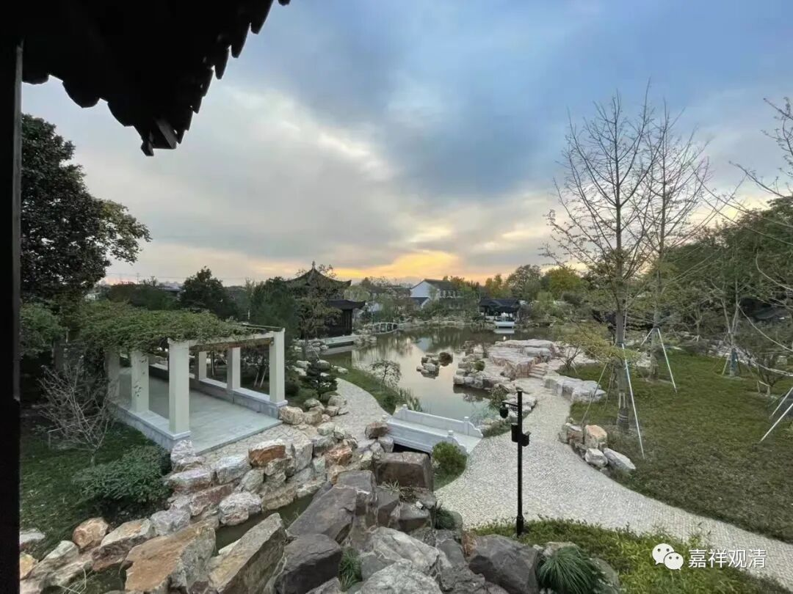

**《微课堂佛教史》214·1**

我们继续佛教史。前面讲到禅宗的六祖大师的弟子，本来想就六祖大师的弟子继续讲下去，但是我觉得接着青原行思禅师下面讲石头希迁禅师比较好，否则之后再讲石头希迁禅师的话，大家可能感觉不太顺。那我索性就把石头希迁禅师先讲了吧。

在青原行思大师的门下，最重要的一位人物就是石头希迁禅师，当时他和江西的马祖道一禅师是齐名的：湖南就是石头希迁禅师，江西就是马祖道一禅师。这两个人的名字呢，其实还不太像后来那些禅宗祖师的名字。

石头，是指他长期居住的地方有一块大石头，他就在那坐着。大家知道，如果坐禅的话，其实看到大石头是很喜欢的。我们以前在九华山也是，一块大石头，稍微有点倾角，不要倾得太过分，在上面盘腿一坐。正好是后面高，前面低，坐起来很舒服的，一坐可以坐很久。

另外一位就是马祖道一禅师，当时二人被并称为“二大士”，马祖道一禅师就是被称为“门下出一马驹，踏杀天下人”的那匹“马”，石头希迁大师被称为什么呢？叫“石头路滑”，石头禅师。

从石头希迁禅师开始往下的禅宗的传记，就富含着禅宗的特色，也就是我讲过的，这些传记基本上就是把几段语录加起来。我们来看一看，能不能从他的这些语录背后找出我们这些教下的人所希望看到的一些东西。

石头希迁禅师的生卒年代大概是公元700年到790年，他有这么长的寿命，所以他的弟子比较多，这再次说明大师们长寿很重要啊！他家里是哪里人呢？是广东人，端州高要人。端州就是出端砚的地方，是吧？现在属于肇庆市，以前是端州高要县。

他小的时候就应该说有一定的“佛缘”，我不知道这和文化水平有没有关系，传记里面也没有专门谈到他有没有世俗文化，我觉得可能有一点关系吧。当时的广东、福建一带非常迷信，大家去那些地方看看就知道了，以前被称为“淫祀”的一种乡间祭祀活动是特别多的，要杀生祭祀，他就把牛给放了。这种情况是经常出现的，说明他是非常反对乡间迷信的，或者说我们可以把他解读为反对乡间的迷信。而从汉朝开始，民间对佛教的基本认识，就是“慈心不杀”。这种自小而有的自发的“放生”行为，我们今天的老太太们讲叫“很有佛缘”。

后来呢，石头希迁禅师就去了六祖大师门下，因为他自己是广东肇庆人，六祖也在广东嘛。他去六祖大师门下的时候年纪应该还很小，还没受具足戒之际，六祖大师就圆寂了，就去世了。他正式受具足戒的时候应该是比较晚了，二十多岁才受的具足戒。

传记当中有一个说法，说当年六祖大师跟他说：“你寻思去。”然后呢，他就在那里打坐，打坐（寻思）很久，也没得到什么结果。最后就有人提醒他，说六祖大师让你“寻思去”的意思，就是让你“寻”青原行“思”禅师“去”，于是他就去找命里的那个人去了……

这个事情我估计又是后人杜撰的，我个人的看法待会我会讲。当然，大家是很愿意看到这些所谓的预言性的故事，但是我个人觉得这个不是预言，待会我会讲（我们这些作为现代学术熏陶过的人来看这些内容，可能真的会有一点不一样啊）。

