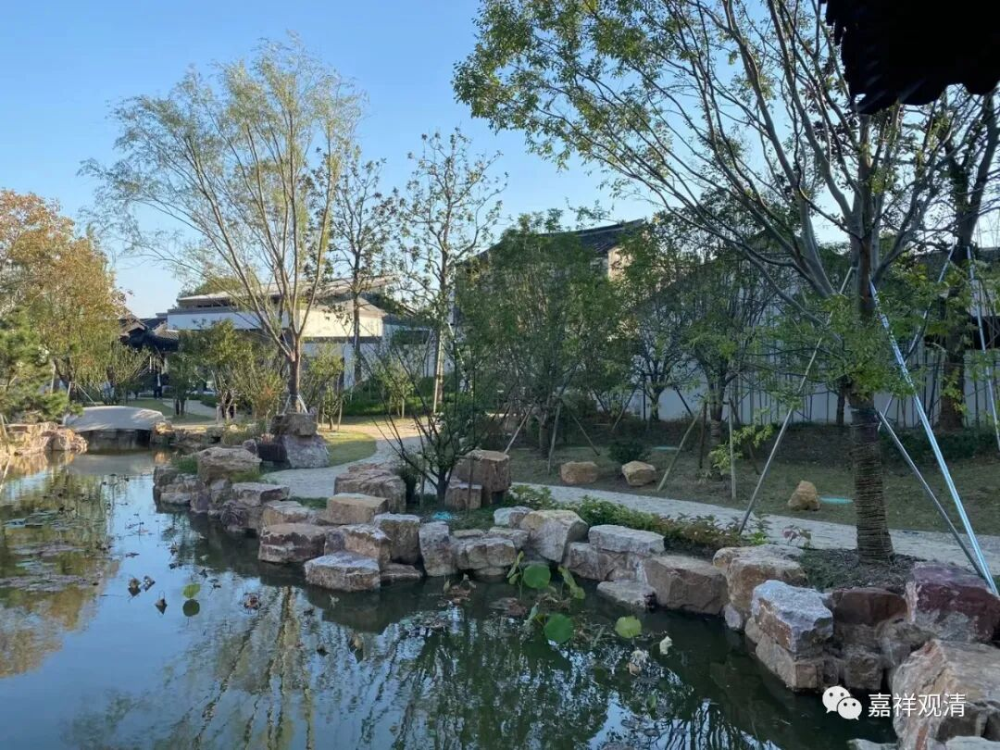
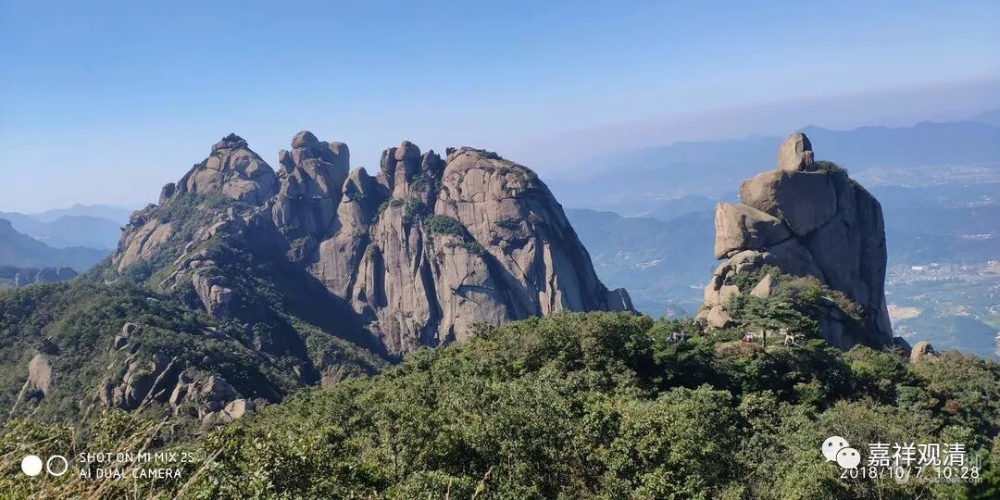
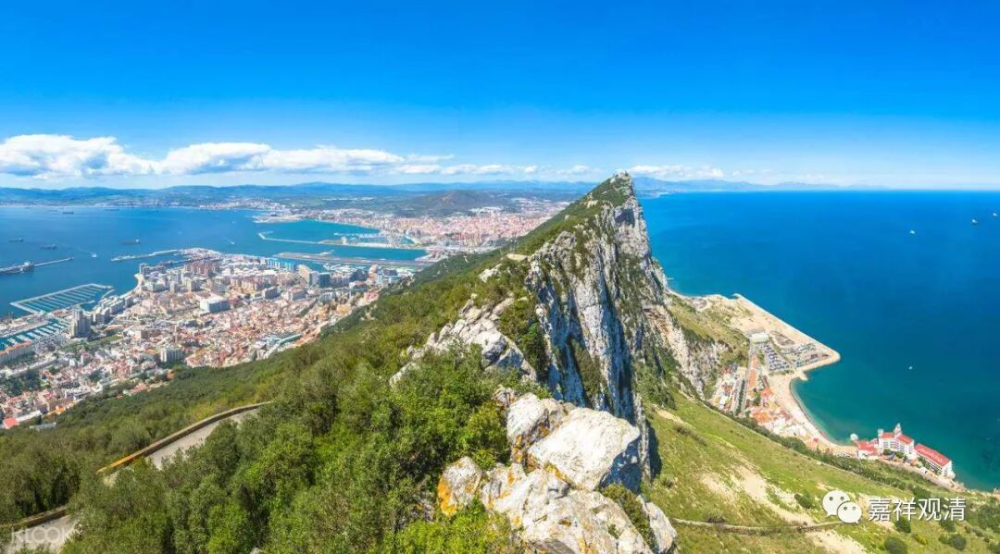

**《微课佛教史》214·2**

听人劝，吃饱饭……于是石头希迁禅师就去了青原行思禅师的那边，青原行思禅师对他来说应该算是大师兄了，对吧？他们两位都在六祖大师门下学习过。接着呢，就开始了一番机智问答，差不多是这样的意思：“你在六祖大师这里学了些什么内容？”“没学什么。”或者是：“没得到什么。”“那没得到什么的话，你去那里干嘛？”“如果我不去的话，我哪里知道我会没得到什么？”就类似这样的机智问答。

我个人觉得，这段应该还是后期禅宗所“赋予”的色彩会多一些，因为这个传记出自《景德传灯录》，此书对早期禅宗史的记载，相较于后期禅宗（略近于《传灯录》时代），早期的传说相对多一点。我们看看能不能从他的这些机智问答背后找到一点东西……

后来呢，他的师父青原行思禅师就推荐他去了一个寺院，叫净居寺——哦，不是净居寺，净居寺是青原行思禅师待的地方。石头希迁禅师是去了衡山，经他的师父推荐，去了衡山的南寺。当时衡山还有一位比较有名的人物，就是南岳怀让禅师，是吧？南岳就是指衡山。而马祖道一禅师是南岳怀让禅师的弟子，是吧？所以南岳怀让禅师在衡山，石头希迁禅师也在衡山，就出现一种说法，说石头希迁禅师曾经在南岳怀让禅师门下学习过。但是在禅宗的传记当中，只是说青原行思禅师让石头希迁禅师给南岳怀让禅师捎带了一封信。这个到底算不算学过呢？我个人觉得这个应该不算吧。当然，算不算他们还是自己说了算，可能不属于专门去学习的情况，但是后来他也确实到了南岳衡山，很可能就是因为这个原因，后人说他跟从南岳怀让禅师学习过。

后来石头希迁禅师就待在这个南寺的的边上——“寺之东”，就是寺院的东面。我估计南岳怀让禅师有好多寺院，然后石头希迁禅师就在南寺的东面结了一个茅棚，在寺院边上，那里的石头比较大，他一直在那里坐禅，所以大家就称他为石头和尚。

我们去九华山的时候，后山那边也有几块大石头，那个石头我真的很喜欢啊！在石头的正对面视野很开阔，也没有距离很近的山峰，再远一些其他的一些山脉，但是近的地方就没有。怎么说呢？那座山也是比较高的，那块大石头是比较突兀的，前面也不算太凶险。那个地方坐起来真的是不错，特别是我们过去九华山的那个时候，气温也正合适，在石头上面盘腿打坐还是不错的，至今记得。

说这个，是想说，通常住山的人很喜欢“大岩石”这种地形，我记得鸡足山也有很多茅棚是类似的情况，福建这类山寺也很多，很多寺院也直接就叫“啥啥岩”……对了，九华山后山那个也叫“九子岩”。

（忽然想起来，直布罗陀就是个“大石头”。）

