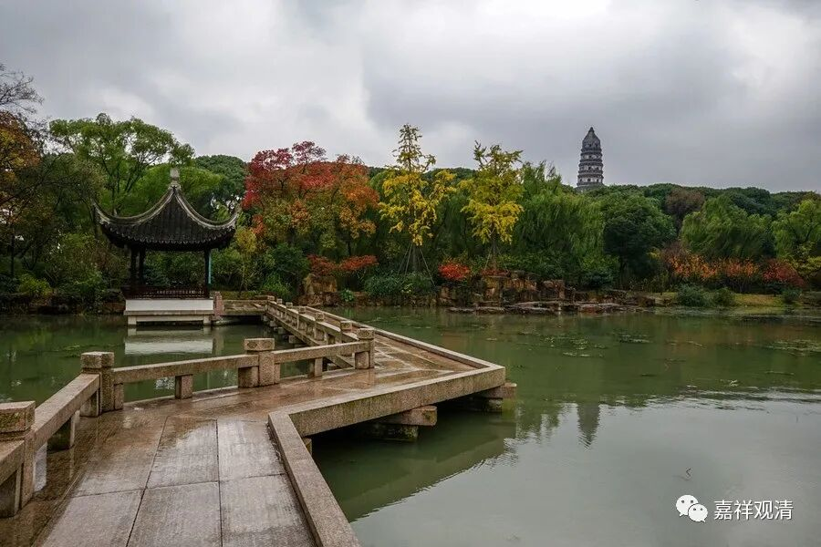

**《微课堂佛教史》215·1**

后来特别讨厌的是，有一个道士——而且还不是正宗的道士，曾经有精神病史，他去到九华山就把这个有大石头的地方给占了。我再过去的时候，他已经在那里盖了两间房，还把那块大石头给劈了。这个道士也在石头上打坐，有点精神病。唉，可惜了很好的一块地啊！我个人觉得比较能够理解喜欢打坐的人看到石头是有点高兴的，至少我自己是这样的。

石头希迁禅师有一篇文章叫《参同契》，它不是《周易》的那个《参同契》哦，也是一篇类似于道歌一样的文章。《参同契》的文字比较漂亮，这样看来他以前确实是个知识分子，可能传记里面没有记载，也可能他的文化水平确实不错，所以才会非常不喜欢当时乡间的淫祀——就是乡间的那种民间宗教，可能是和他世间的文化水平有关。

以我们今天的情形来看，石头希迁禅师的名气好像没有马祖道一禅师那么响亮——虽然名气也是很响的，但是好像没有马祖道一禅师响。实际上，禅宗的五家当中，有三家都是出自石头门下，其中还有天皇道悟禅师，也和他有关。

那么，以我个人来讲，我就从石头希迁禅师的语录当中去寻找我自己想看的东西。比如说，别人问他：“如何是解脱？”什么是解脱呢？他是怎么回答的呢？他就反问那个人：“谁缚汝？”

又有人问：“如何是净土？”石头希迁禅师怎么回答的呢？仍然是反问：“谁垢汝？”是谁把你搞脏的呢？你问的是净土嘛。

又问：“如何是涅槃？”回答是什么呢？“谁将生死与汝？”

我们看，这里面很有趣，对吧？请问什么是解脱？回答却是：谁来绑着你的？因为绑缚和解脱是一对，大家还记得吗？然后问“净”土，又来回答“垢”，因为“净”和“垢”又是一对，是吧？然后问什么是涅槃，回答谁将生死于汝。大家看这个是不是就是《坛经》里讲的三十六对啊？是吧？你问我A ，我就跟你讲非A，这个，就是早期禅宗常用的“套路”。

禅宗的后期，就表现为在祖师的传记里面大量地出现这种机智问答，反而是有什么其他的功绩等等都说得少了，甚至还会编造一些故事出来。比如说流行的关于临济义玄的故事基本上都是编造的，呵呵，这个我们后面会仔细讲。有时候真的是有点头大……还有什么情况呢？有时候编纂的这个人会搞错，把同样名字的两个人就误认为一个人，或者把一个人拆成两个人，这些情况都有。（主要是编传记的人越来越不专业……）

