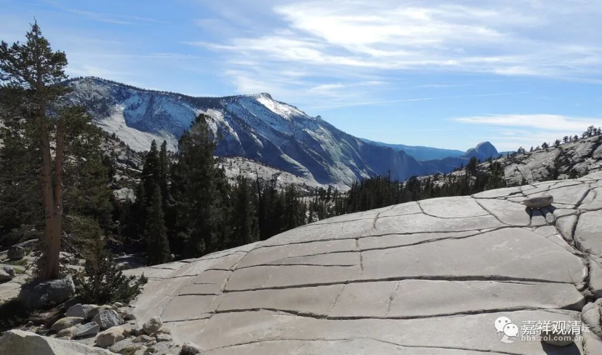

**《微课佛教史》215·2**

那么，还有一个什么情况呢？刚才我们讲过的，有一个符号，说是六祖慧能大师对石头希迁禅师说“寻思去”，相当于是他的老师教他“寻思去”，那他平时怎么做的呢？他叫石头希迁禅师，对吧？他就喜欢在大石头那里打坐。他最重要的弟子叫药山惟俨禅师，没事也是常常闲坐，也喜欢没事就在那儿坐着。药山惟俨禅师经常说的是什么呢？叫“思量个不思量的”。

你看，这一路的符号——“寻思去”、“思量个不思量的”、“喜欢坐在石头上”、“在石头上结茅棚”，就是喜欢打坐嘛！然后他的重要弟子药山惟俨禅师也是喜欢打坐。后来的曹洞宗，发展到宋代的时候，最强调的是什么？“默照禅”，后来曹洞系解释为“只管打坐”……这都是一路的。所以我认为，“寻思去”的意思，就是让他好好地去打坐修行，并不是让他去寻找青原行思禅师，而且我们可以从禅宗史上清楚地发现“只管打坐”就是禅宗这一支的“特色”。

在石头希迁禅师的门下，将来要开出洞山良价禅师、曹山本寂禅师等等，这些人都是相当强调禅宗的。我这里说的禅宗，就是指相当强调寻思、思量、禅修、打坐的。包括后来的曹洞宗也特别强调“只管打坐”的说法。而现在的语录当中，就表现为好像石头希迁禅师喜欢斗嘴。我觉得这种喜欢斗嘴的情况，还是后期的记录所造成的。

我上次讲到过一个事情，就是后来有人认为天皇道悟禅师是马祖道一禅师门下的人，那就变成马祖道一禅师下面要出四支，这应该说是后期禅宗当中出现的一种“争地位”的说法。实际上以历史来讲，我们恐怕更应该说是石头希迁禅师门下分出了三派，这种可能更接近事实……

后面禅宗因为出现了争地位的情况，就觉得马祖道一禅师很厉害，于是想帮他把子嗣立得广大一点。但这种做法实际上并没有意义，对吧？师父的门下开不开得出多的派别，并不代表师父厉害不厉害。有些师父自身是很厉害的，但是徒弟的派别开不出来，也是正常的事情嘛。

那么，石头希迁禅师的寿命比较长，所以他的子嗣也就比较丰富，比较绵长，这种情况是很正常的。我们顺便讲一下他的弟子招提慧朗禅师，就随便谈一下，他也是什么情况呢？在寺院里面待着，一待就是三十年，足不出户，也是表现为大禅师的那种感觉。所以，应该说从石头希迁禅师开始，到药山惟俨禅师，到招提慧朗禅师，包括到后面的洞山良价禅师、曹山本寂禅师，以及后来曹洞宗所讲的“默照禅”，都有一脉相承的思路。因此，我还是要说，六祖慧能大师对石头希迁禅师讲的“寻思去”，不是让他去找青原行思禅师的意思。

今天就先讲到这里，其他好像也没什么可以多讲了，谢谢大家！

