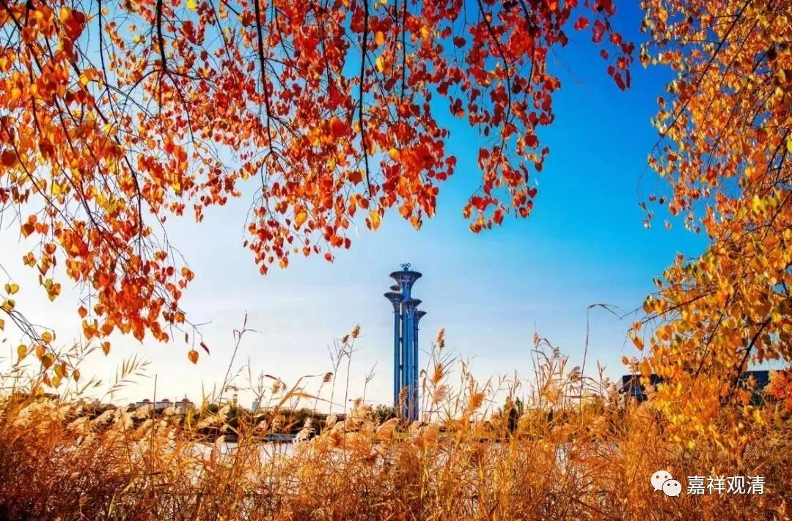

**《微课堂佛教史》216·1**

我们继续佛教史。

上次谈到了石头希迁禅师，他的老师是青原行思禅师，而青原行思禅师的老师是六祖慧能大师。慧能大师座下的几位大弟子，或者说比较重要的几位弟子吧，我们已经讲了四位，是吧？菏泽神会禅师、永嘉玄觉禅师、青原行思禅师，还有一位就是南岳怀让禅师。哦，应该还有一位弟子我们还没有讲，就是南阳慧忠禅师。我们今天先讲南岳怀让禅师。

其实我们可以考虑一下要不要讲一讲法海禅师，就是敦煌本的《坛经》是由法海禅师传下来的嘛。他也是六祖慧能大师的弟子，不过他对于禅宗后期的影响力不大。（但是，真的，如果说实话，到底怎么才算是影响呢？真的不知道啊。）

我刚才出去逛了逛，在房间里待的时间长了有点气闷，所以就到潮州的街上去逛一逛，看到了一本饶宗颐先生的佛教文选，以后我再去买一本吧。在饶宗颐先生的著作里面提到了菏泽神会禅师门下的一些事情，我们过两天再说吧。

摩诃衍禅师就是菏泽神会禅师直接的弟子，这本书里面提到的一些内容确实值得讨论的。不过是不是要在我们这个群里讨论，就不知道了。因为这些内容比较偏学术一点，如果大家有兴趣的话，我们也是可以讨论一下的，就是关于摩诃衍禅师的故事。

好，现在我们先讲南岳怀让禅师吧。南岳怀让禅师的传记也是出现在《景德传灯录》当中，灯录中他的传记还是具有比较明显的后期禅宗的特色，跟前面提到过的类似，更多地出现了一些机智问答、脑筋急转弯。这个机智问答当中有一段，我有自己的一些想法，等会讲完以后我再来说。

南岳怀让禅师呢，说是金州人——金子的金。（这个地方我还没查过，大家可以去查一下这个金州在哪里，我估计大概就在河南、湖北的附近。）南岳怀让禅师也是十五岁的时候就去了湖北当阳的玉泉寺。

大家还记得吗？曾经有好几位很重要的人物在当阳的玉泉寺待过，包括天台宗的智者大师也曾在玉泉寺待过。而且玉泉寺还有一个关于关羽的故事，是吧？前一段时间我们讲到了菏泽神会禅师，而神会大师也在这里待过。如果没记错的话，好像神秀大师也在这里待过，待会儿我再看一下。

首先，这个寺院比较重要，肯定在当时是一个大寺院，历代的几位大师都曾经在那里待过。其次呢，前后出现过几位修禅的大师，包括天台宗的智者大师也可以算是修禅的大师，也可以称为禅师。其实在这个时候的禅宗，还没有发展到后期禅宗的那种性质，当时社会对“禅师”的定位是：禅修比较好的人，或者比较重视禅修的人。当阳玉泉山，重要的几位大师（还有二爷。二爷成神的故事，发源地就在玉泉山）都在那里待过。

