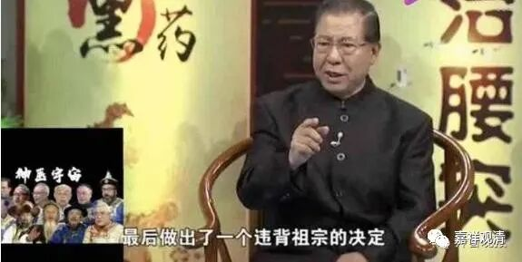

**《集论选讲》042·2**

就我们一般的理解而言，“惭”就是“自羞”，“愧”就是“羞他”，这样就可以了，一般人不需要死扣一些纯属于宗派内的定义。“惭”是什么呢？就是我们通常讲的自惭形秽，是针对自己的。“愧”是什么呢？是针对别人的。前两天有一类的广告很火，呵呵，“我做出了一个愧对祖宗的决定……”他对不起的“他人”就是“祖宗”。

我们一般的理解就可以完全按照《集论》的说法，包括在《集论》之前大部分的阿毗达摩也是按照这么来说的——“惭”和“愧”的差别是在对象上面，针对自己，或者针对别人。

好，接下来是三善根。

负面的烦恼当中，最重要的就是“贪”、“嗔”、“痴”，那么在善法当中，最重要的就是它们的反面——“无贪”、“无嗔”、“无痴”。“无”，就是一个前缀，相当于英语当中的im、in、un这些否定前缀。“无贪”，可以这么理解，它就是“贪”的反面，或者说“贪”的对治，是可以对治“贪”的。那么“无嗔”、“无痴”也可以通过这一样的套路去理解。

** 无贪者，于有、有具，无著为体，恶行不转所依为业。**

“有”就是轮回，“有具”就是轮回的整个外部世界，“无著为体”就是不贪著，“恶行不转所依为业”，就是坏的事情不做，而坏的事情不做，首先就要不贪，是这个意思。

也有人提出来说我们现在所讲的“还是比较难理解”，我个人没觉得现在所讲的比较难，如果想要学佛的话，目前的这些名词至少约定俗成的意思你是必须要过的，你必须要看得懂这些名词。如果说这些名词你都看不懂，然后说虽然佛教名词你看不懂，但是佛经你能够理解——这是不可能的！（有些跟帖的人叫得很high，就是最好的注脚，类似那种没有经过力量速度步伐的基础训练就去拳馆踢场子的，这种行为纯粹在找死呢。）

在我们现在的这个时代，只能在这个背景之下去学习。如果我们这个时代能够再出现新人，把这些经典重新用白话翻译一遍，而且不是一两篇的翻译，是几千卷的成建制的白话翻译，那么这里面的一些内容就可以重新用白话文更好地解释。但实际上就我看起来，这些文字已经够白话了。还有一点，我昨天也讲过了，其实白话的变化实在太快了。即使我们现在把它固定下来，可能二十年以后就要出问题了，五十年以后的人就看不懂了……白话的变化太快了，很难固定下来。书面文字相对固定一点。

