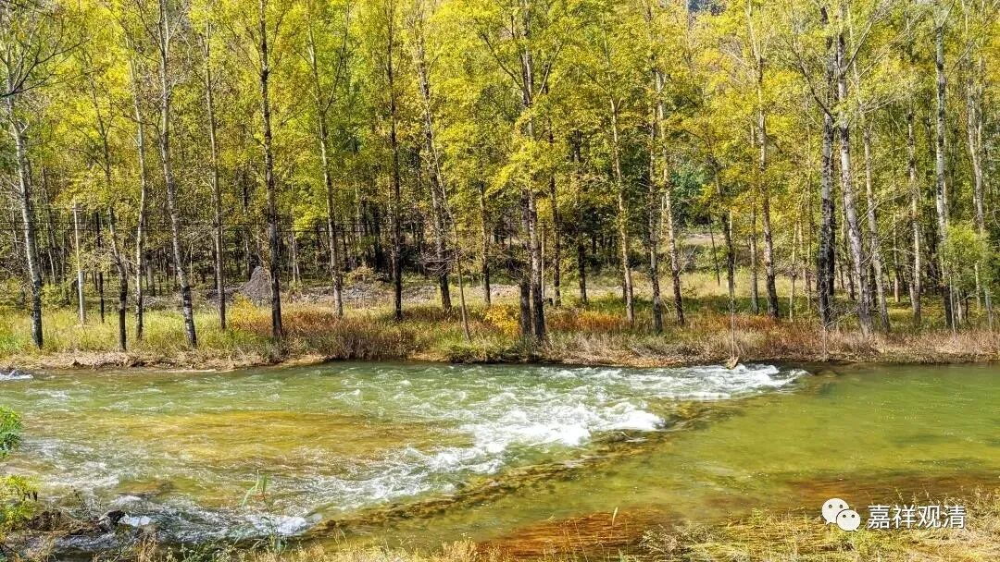

**《微课堂佛教史》217·1**

祖问：“什么物恁么来？”额，这句话我也不知道怎么解释。很多人都有不同的解释，我们先就这么读过去吧。

然后南岳怀让禅师就回答说：“说似一物即不中。”

后人认为是中（zhòng）是第四声。一般对这句话的解释就是：说它像一个东西就不太对。“说似一物即不中”，这个“不中（zhòng）”应该理解为不中（zhǒng），就是不对的意思。这个是我自己的理解，我们待会再说。

然后，慧能大师就说：“还假修证否？”

回答说：“修证即不无，污染即不得。”

六祖大师说：“只此不污染，诸佛之所护念。汝既如是，吾亦如是。”所以我们可以看到，六祖大师都已经认可他了，来的第一天就认可他了。我们看到目前为止的六祖慧能大师的这几位弟子，好像有好几位都是慧能大师见了第一面就开始认可的，这里，南岳怀让禅师也是见了第一面就承认的样子。

传记在这后面又加了一段，说：“西天般若多罗识（在这里是“识”，有些地方写“谶”，谶纬的那个谶，就是预言的意思）汝足下出一马驹，踏杀天下人。”那么，大家就认为这句话就是讲的马祖道一禅师。这句话呢，应该是后期才出现的，因为早期的时候好像还没出现什么西天般若多罗的说法，这应该是属于宗教化的东西。

那么，前面对话中的“什么物恁么来”和“说似一物即不中”，到底是什么意思呢？（外面一般的解释是怎么说的……我就先不帮别人讲了。）“什么物恁么来？”应该怎么去理解我先不管了，但是我有一个自己的解读——

这句话还是当时的一句口语。这个“什么物”，其实就是指你，这句话的意思就是：你怎么来的啊？（来的是什么东西啊？）所以南岳怀让禅师的回答“说似一物即不中”，我的解释就是：这样说不好吧？你说我是“什么物”，说我是物，这个“不中”，不好吧？差不多是这个意思。后来我在一个中国人写的英文禅宗书当中发现也是把这一段翻译成了“把我说成是东西总不太好吧”，我看这本书对这个公案的翻译跟我的理解有点一样。

