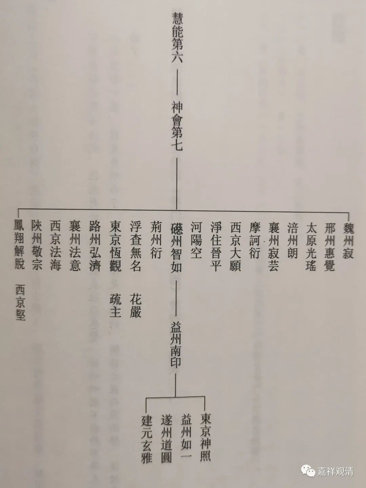

**《微课堂佛教史》218·1**

好，我们现在继续科学唯物的禅宗史。

昨天因为在路上就没有讲，忘记给大家说了，其实我自己也是真的忘了，今天我们继续吧。

我们讲到了六祖慧能大师的五位比较重要的弟子，已经讲了其中的四位——菏泽神会禅师、青原行思禅师、南岳怀让禅师和永嘉玄觉禅师。接下来我们要讲南阳慧忠国师。

我们讲禅宗的兴起一定不是一个孤立的事件，它一定是有很多的原因所促成的，其中一个比较重要的原因就是南阳慧忠国师。

说起来上次我们提到过了，菏泽神会禅师好像是在六祖大师兴起的背景下非常重要的一位人物，但是从历史上来说，菏泽神会禅师实际上只是一位昙花一现的人物，原因就是他在历史上露面的时间非常短，也就是在安史之乱后期到安史之乱结束以后，有那么几年的时间，而且荷泽系子嗣并不绵长，并不是说没有，是“长链”的不多。

有人说菏泽神会禅师的弟子很少，我们不妨说，并不是菏泽神会禅师本人的子嗣不多，实际上菏泽神会禅师门下有名的弟子大概有二十个左右，是非常多的，只是这一支后来的子嗣不够绵长，所以说长久是很重要的，不仅仅是多。比如说马祖大师，手下出一百多名善知识，再往后不断不断地人才辈出，这就够了。再比如说像曹洞宗这些，很有可能到后来并不是洞山之后的曹山的背景，包括云门宗也是一样的情况，很可能“大弟子”在后来的传播当中并不是最重要的。

菏泽神会禅师的门下我不知道还会不会讲到，今天就不妨再多说两句。根据饶宗颐先生的那本佛教论文选（我只看了一点，好像有点意思哦），就是说如果以某些文献来看，《吐蕃僧诤记》当中出现的摩诃衍禅师是既跟从北宗的禅师学习过，又跟从菏泽神会禅师学习过。而同时有另外一位禅师也到了当时的西藏拉萨，参加过禅宗教法的传播，叫达摩么低。

根据饶宗颐先生的考证（《饶宗颐佛学文集·神会门下摩诃衍之入藏——兼论禅门南北宗之调和问题》），说这个人很有可能就是菏泽神会禅师门下的另外一位弟子叫法意禅师（上图左起第四之“襄州法意”），因为梵文达摩么低dharmamati，恰好是法意。

如果是这样的话，我们可以看到，菏泽宗将佛教或者禅宗传入西藏的时候是以一个集团军的形式开展的，不是一个人孤军作战的，而是两个人甚至还有他们的同学、弟子们，不是单纯只有摩诃衍禅师。

