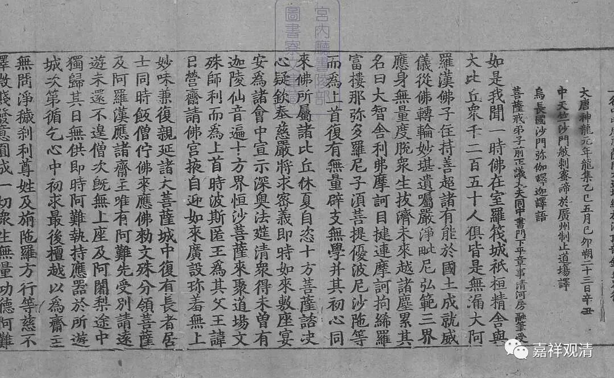

**《集论选讲》044·2**

然后再讲“不害”。

** 不害者，无嗔善根一分，心悲愍为体，不损恼为业。**当知不害不离无嗔，故亦是假。

在《集论》当中，“不害”也还是一个假法，是“无嗔善根一分”，什么意思呢？它是“无嗔”的一部分，或者说它属于无嗔，所以也是没有自体的。在《集论》当中，“不放逸”、“行舍”和“不害”都是无自体的。

“心悲愍为体”，正是由于这个“心悲悯为体”，就造成了大乘后来讲慈悲的“悲”就是“不害”。《成唯识论》中说不害就是无嗔，也是假法。

“不损恼为业”,“不害”的作用，就是“不”损恼（害）其他众生，是吧？

因此，在《集论》当中认为“不害”是假法。我记得上次整理过一个表格，放哪儿也忘了，要去找一下。所以，“不放逸”、“行舍”和“不害”在有部当中应该都是实法，而在这里都是假法。

（找到了——心所假实的对照表）

俱舍论

集论

成唯识论

成实论

中观

** 作意**

实法

实法

实法

假法

假法

** 触**

实法

实法

实法

假法

假法

** 受**

实法

实法

实法

假法

假法

** 想**

实法

实法

实法

假法

假法

** 思**

实法

实法

实法

假法

假法

** 欲**

实法

实法

实法

假法

假法

** 胜解**

实法

实法

实法

假法

假法

** 念**

实法

实法

实法

假法

假法

** 等持（三摩地）**

实法

实法

实法

假法

假法

** 慧**

实法

实法

实法

假法

假法

** 信**

实法

实法

实法

假法

假法

** 惭**

实法

实法

实法

假法

假法

** 愧**

实法

实法

实法

假法

假法

** 无贪**

实法

实法

实法

假法

假法

** 无瞋**

实法

实法

实法

假法

假法

** 无痴**

假法

假法

实法

假法

假法

** 精进**

实法

实法

实法

假法

假法

** 轻安**

实法

实法

实法

假法

假法

** 不放逸**

实法

假法

假法

假法

假法

** 舍（行舍）**

实法

假法

假法

假法

假法

** 不害**

实法

假法

假法

假法

假法

** 贪**

实法

实法

实法

假法

假法

** 瞋**

实法

实法

实法

假法

假法

** 慢**

实法

实法

实法

假法

假法

** 无明（痴）**

实法

实法

实法

假法

假法

** 萨迦耶见**

假法

假法

假法

假法

假法

** 邪见**

假法

假法

假法

假法

假法

** 边见**

假法

假法

假法

假法

假法

** 见取见**

假法

假法

假法

假法

假法

** 戒禁取见**

假法

假法

假法

假法

假法

** 疑**

实法

实法

实法

假法

假法

** 忿**

实法

假法

假法

假法

假法

** 恨**

实法

假法

假法

假法

假法

** 覆**

实法

假法

假法

假法

假法

** 恼**

实法

假法

假法

假法

假法

** 嫉**

实法

假法

假法

假法

假法

** 悭**

实法

假法

假法

假法

假法

** 诳**

实法

假法

假法

假法

假法

** 谄**

实法

假法

假法

假法

假法

** 憍**

实法

假法

假法

假法

假法

** 害**

实法

假法

假法

假法

假法

** 无惭**

实法

假法

实法

假法

假法

** 无愧**

实法

假法

实法

假法

假法

** 惛沈**

实法

假法

实法

假法

假法

** 掉举**

实法

假法

实法

假法

假法

** 不信**

实法

假法

实法

假法

假法

** 懈怠**

实法

假法

实法

假法

假法

** 放逸**

实法

假法

假法

假法

假法

** 失念（忘念）**

假法

假法

假法

假法

假法

** 心乱（散乱）**

假法

假法

实法

假法

假法

** 不正知**

假法

假法

假法

假法

假法

** 恶作（悔）**

实法

假法

实法

假法

假法

** 睡眠（眠）**

实法

假法

实法

假法

假法

** 寻**

实法

假法

假法

假法

假法

** 伺**

实法

假法

假法

假法

假法

我本来还想在表格当中加上“新唯识论”的一些说法，熊十力先生也挺好玩的，他脾气有点大，自己想当论师，名字叫“十力”——“十力”就是佛啊，呵呵。

以上这些就是十一个善法。

