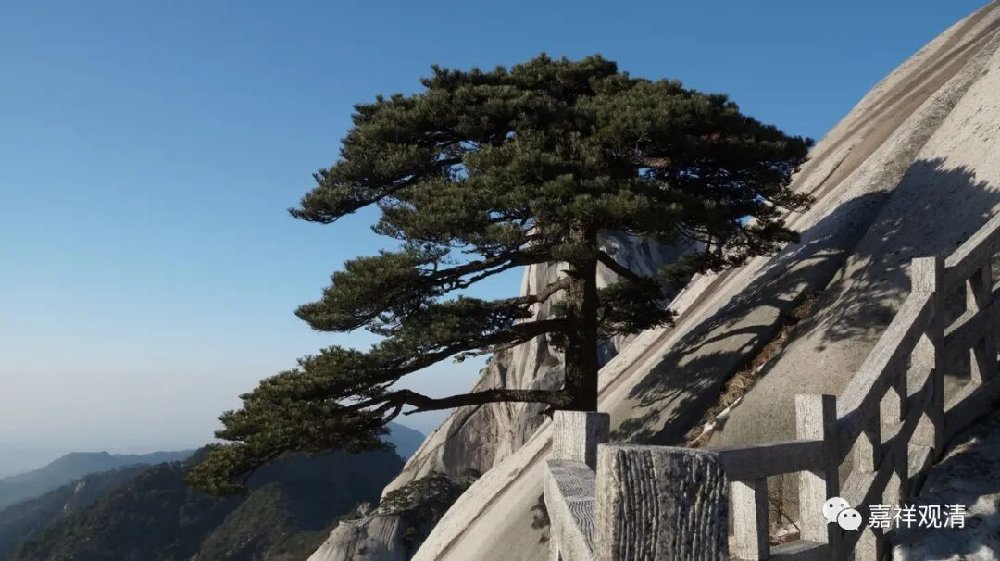

**《集论》选讲046·1**

好，我们继续《集论》选讲。

现在讲到五种不正见，就是五种见——“萨迦耶见、边执见、见取见、戒禁取见、邪见”。前面已经讲了“萨迦耶见”和“边执见”，现在讲“见取见”。

** 见取者，谓于诸见及见所依五取蕴等，随观执为最、为胜、为上、为妙，诸忍、欲、觉、观、见为体，执不正见所依为业。**

** **

“见取见”是什么呢？“见”就是观点。我们可以认为是哲学观点（或者说是……我也不知道怎么讲，某种观点？有点接近“形而上学方面的认识”这个意思。）“见取者，谓于诸见”，就是对于各种观点，“及见所依五取蕴等”，或者随见所依的五取蕴等，“随观”，观察上述这些，“执为最、为胜、为上、为妙”，这个是最好的，这个就是第一。大家都认为自己的观点才是对的，是吧？是最高的，是吧？基本上不会有说“我的观点排第二、排第三”。

你要说完全没有，好像也很难说。但是一般来说，自己确实会说自己的观点是最高的。当然极个别的例外也有，但是即便他认为自己的观点不是最高的，他在后来还可以认为他其实并不是持有这种观点，而那个最高的观点才是他的根本观点。这就有点复杂了，不过的确存在这种情况。

比如说，我们碰到有些人自认为是唯识的，到最后却认为唯识也不对。呵呵，他认为到最后还是要胜义空的，其实他的这些观点已经不再是唯识的了。或者天台宗的人，在日本也有，自己是天台宗的，但是又说什么呢？说“密宗第一、禅宗第二、天台第三、华严第四”。自己作为天台宗的人，这么排也是比较罕见的了。一般来说，都会认为自己的宗派是最高、最胜、最上、最妙的。

“诸忍、欲、觉、观、见为体”，这个我们前面已经解释过了，这里就不讲了。“执不正见所依为业”，其他的不正见都可以在这上面安立。

“见”，简单来说就是观点，不能说是所有的观点，是指比较重要的那些，对事物终极方面的认识。比如说胜论派的地水火风空时方我意，比如说十四无记——世间是有边的，世间是无边的等等……都是一种观点，“见取见”，指的就是比较重要的一些观点，我也不知道白话起来该怎么说，大家领会精神吧。如果不白话，就是在“见”上“取”为“见”，取为认识或观点——这个观点是指接近于终极的观点，所以我在前面讲哲学观点。其实单纯说是哲学观点也不能完全，因为哲学的范围比较宽……就是对事物终级的认知、终极的解说、在究竟层面的认识。佛教看起来只要和它讲的不一样的，都是有问题的，呵呵。这就是“见取见”。

我在大学生的时候曾经碰到过一位法师，他在讲唯识的时候说取佛教的见解也是“见取见”——他这个说法就不对了啊。不是所有的观点都是“见取见”，是要依这五个“不正见”。如果取佛教的观点也是“见取见”，那就过头了。那位法师讲“戒禁取”的时候也有问题，他说只要你把戒律当作是对的，那就是“戒禁取”，这个不是啊，“戒禁取”指的是错误的戒律。

