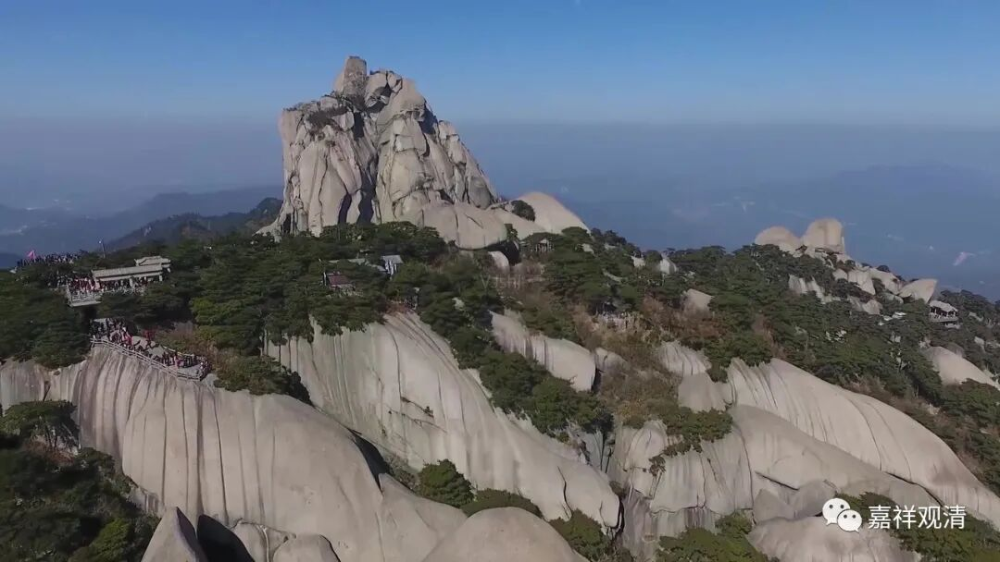

**《微课佛教史》221·2**

禅僧如果住山的话，会怎么样呢？住山的禅僧更接近于一个头陀，很像那种头陀行的人。如果从实际出发来看，在中国乞食确实不像印度这么方便，民间没有这个传统。而且僧人一旦住山了以后，他的行为就和城市里面的僧人不一样了。按照戒律里面的规定，实际上修行的地方离开聚落应该不会太远。

按照戒律里面的说法来换算，和尚能离开聚落（村里）取水的地方也就几百米的距离，差不多就是距离水源地，或者说距离村落最远的水源地应该在三百米以内。哦，实际上应该是两百米以内，戒律里面好像是说一个最有力的人，捡起一块石头扔出去，然后再扔两次，一共扔三次的距离。如果按照今天的手榴弹来计算的话，绝对应该是在两百米以内的。

但问题是，一旦住山，就不太符合这个条件了。离聚落太远的话，出去化缘肯定是不方便的。又不能采集，是吧？戒律里面也不允许采集的做法。不能采集，怎么办呢？只有种地了，显而易见就会出现这种情况。

禅僧多半在一开始的时候并不存心建造寺院，而是自己住山……名气出来以后，弟子们就越来越多，然后就开始各人搭各人的茅棚，大家就这样慢慢地聚集起来，慢慢就有了初级规模的寺院……一般都是这样的。

所以说，百丈怀海禅师初创的丛林制度和“一日不作，一日不食”，也不是突然之间发生的，是由禅僧的性质所决定的，从而慢慢演变出来“丛林制度”。

禅僧在城市里面就不是那么方便开展集中的寂静禅修，所以一般都是到阿兰若去修行（我们喜欢省略，就叫了“兰若”），禅僧大量地住山之后，就慢慢地开始聚集，逐渐形成了以某个著名禅师为核心的僧团，然后就要出现整理队伍（僧团）的工作。可以说，百丈怀海禅师是当时整理僧团比较成功的一位人物。

哎？怎么讲到这里来了？哦，我们是从牛头慧忠禅师的律僧的习惯出发，就一直谈到了百丈怀海禅师的一些事情。

关于牛头慧忠禅师其他的故事好像并不多，就讲在他门下得法的人有三十四个，就是说他的弟子不少。其实得法这件事情，可能还是后面的人所说的。在《景德传灯录》当中留下了牛头慧忠禅师的一个偈子：

“人法双净，善恶两望，

直心真实，菩提道场。”

从这个偈子我们可以看到，好像牛头系的早期也特别多的出现这种偈颂，很有趣。在传记的前面还有一些其他的偈子，比如说他先前见到智威禅师的时候，也有一些双方问答的偈子。

好，今天是因为南阳慧忠禅师而谈到了另外一位很容易和他混淆的差不多同时代的牛头慧忠禅师。那今天就先到这里，谢谢大家！

