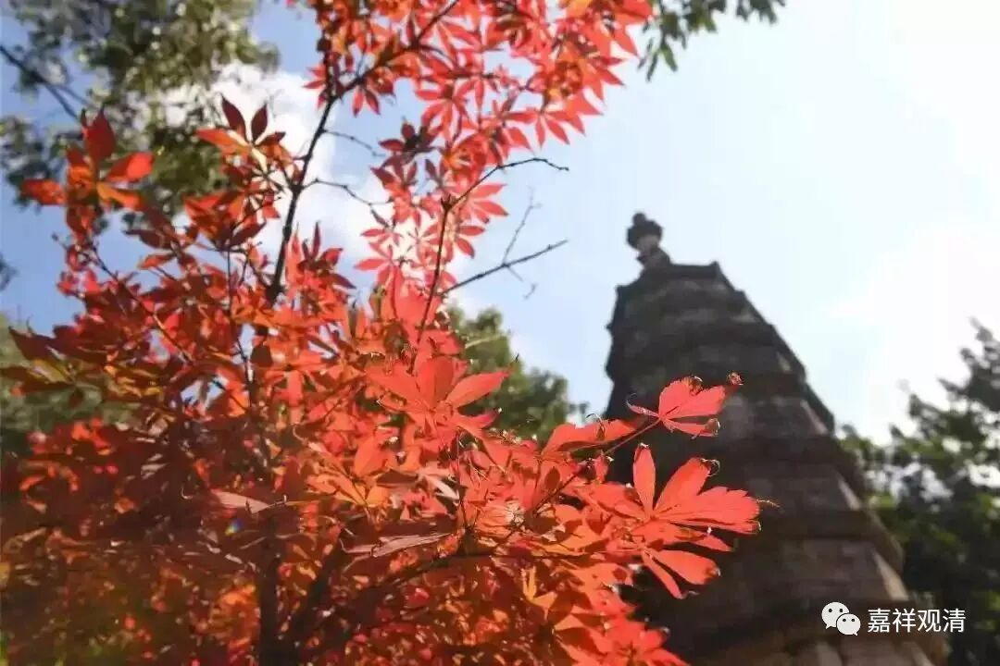

**《微课佛教史》222·2**

（2021.12.02发的222·2，咱也很对称哦。）

关于六祖大师，我们专门提到过传衣的事情，（1、）据说达摩大师的衣钵最后是传到了六祖大师的门下，当然就留在六祖大师那里了。那么，据另一些禅宗里的史传记载，（2、）说是这个衣钵被皇家请去供养，后来还有一些说法则说（3、）衣服又被送回曹溪了……（4、）还有说因为当时智诜禅师在武则天那里受到尊崇，所以后来就把袈裟交给了智诜禅师，由他来保护。……有了这样多种不同的说法。按最后这一种说法，智诜大师这一系后来就流传了这一袈裟。

其实还有一种说法，就是《木棉袈裟》这部电影里面说的，是于荣光演的，（5、）说袈裟是留在少林寺的。说到少林寺，我们之前也提到过法如禅师，法如禅师这一系其实出了不少的人，在少林寺一直存在着一支禅宗的法脉流传，主要是五祖弘忍大师门下的，然后就出现了我们上次讲过的法如禅师这一系的。（我们先把这一支放在边上以后再说。）

那么，智诜禅师有一个弟子，叫处寂禅师。后来处寂禅师又有一个弟子，叫无相禅师。无相禅师之后就是无住禅师，保唐宗主要是和无住禅师有关。

无相禅师是一个朝鲜人，那个时代东征朝鲜以后，中国和朝鲜、和高丽之间的相互影响就非常多。我们上次讲唯识宗的时候大家就已经知道了，唯识宗当中好多人比如遁伦论师、圆测大师等等都是朝鲜人，或者说都是高丽人。（好像有一个老先生专门有论文收集了在中国的高丽高僧。）

无相禅师，在江湖上又被称为“金和尚”。所以大家一看到那段时间记载里出现的“金和尚”，就知道是保唐宗的无相禅师。刚才讲了，无相禅师是韩国人，或者说朝鲜人、高丽人都可以。又说他是新罗王子（呵呵，好像过来中国的都是王族）。

无相禅师来到了四川的资中——现在叫资中，以前叫资州，资粮的资。然后就在处寂禅师的门下学法。学法以后呢，就在成都净泉寺（有些地方叫净众寺）开禅，传法的时间非常长。他生活的年代应该和菏泽神会禅师差不多，算起来比菏泽神会禅师要晚一辈，是吧？但是时间上和菏泽神会禅师差不多同期，地点则是在成都。

这个时候z地刚刚开始接受佛教，而禅宗就差不多在此时有（不少于）两支传入z地。一支是菏泽系的，后面我们会提到像摩诃衍禅师，还有另外一位法意禅师。这两个人从甘肃这一带，从河西走廊进入今天的藏地。另外一支就是这里提到的保唐宗，从四川经过西康这个地方（就是今天的康区），然后进入z地。这两支都是禅宗的六祖慧能大师的门下，而且那个时候离六祖大师的时代并不遥远，所以这两支的观点是比较接近的。

