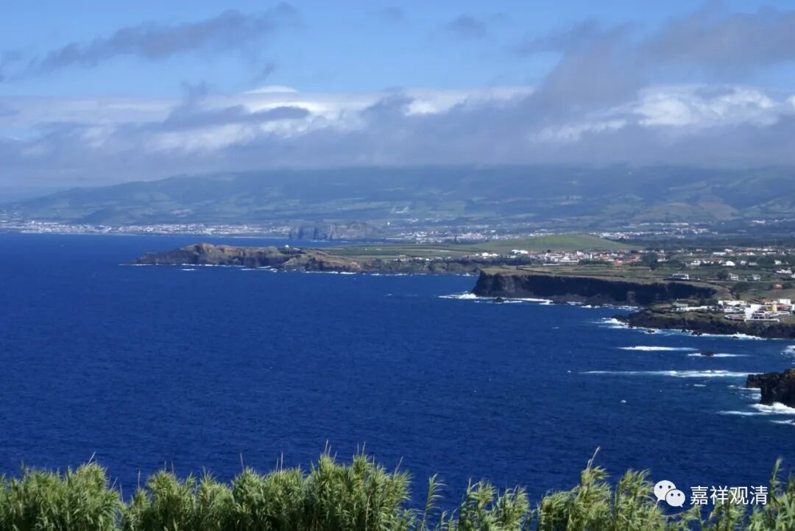

**《微课佛教史》223·2**

上次应该也提过，就是我自己在出家以后，也面临了禅与律在行持方面不一致的问题，特别是我自己（我也是学禅宗的）和师兄弟们，在这些方面确实有点格格不入。比如说耕地，在戒律当中应该是不可以的，不过……这个事情好像现在也不方便说太多，那我们今天也不多讲了。

我就是想让大家知道一下，在四川有这样一系的禅宗——保唐系，他们的主要寺院是净泉寺（有些地方叫净众寺）和保唐寺，我们把他们这一系称为“保唐宗”。

“保唐宗”这个说法是从哪里开始出现的呢？再往后一点点，在圭峰宗密禅师的时候，在他的著作《禅源诸诠集都序》当中就提到了“保唐宗”这个词，是把保唐宗当作和菏泽宗、牛头宗、天台宗互相平行的一种禅师体系，这说明在一个时期，保唐系还是挺有实力的。

不过保唐宗似乎和天台、牛头系一样，地域的局限性太强，没有走出四川——而临济义玄是走出江西、湖南而北上（石家庄）的，法眼文益东出浙江，雪峰义存在福建……这洪州系（马祖系）、石头系门人没有收到地域方面的限制（另外，当时江西、湖南受到唐武宗灭佛运动的影响要小于中原一带）。

保唐宗和菏泽宗比较接近，他们分别由河西走廊和四川进入了Z地进行传法。应该说，在向Z地传法的过程当中，一度获得巨大成果。

拉萨僧诤之后，从北边传入Z地的禅宗的摩诃衍禅师这一系势力迅速退回敦煌一代，退出的时间比较早，而保唐宗在康Z地区的传播则不像北边摩诃衍禅师退得那么干脆，甚至可以说，现在 Z传佛教（四川方面）的部分教法可能还是受到了保唐系的很大影响。

今天先讲到这里，谢谢大家！

