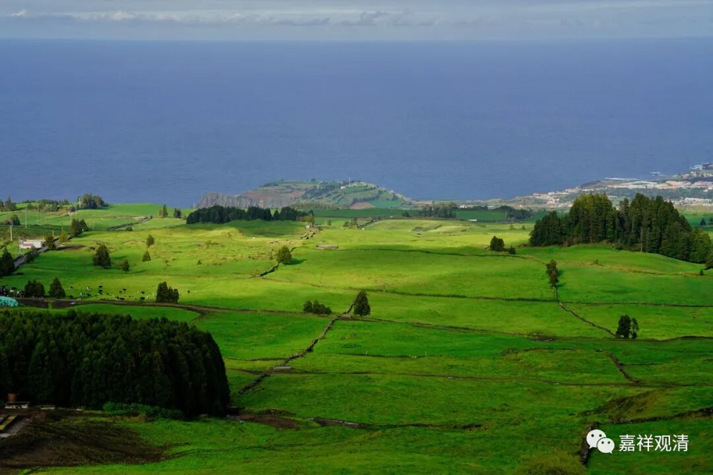

**《微课佛教史》224·2**

今天我们再稍微谈一下江湖上人称的马祖道一禅师。

一听这个名字——马祖道一，就知道这位禅师姓马。那么，为什么要叫马祖道一呢禅师？我们可以看到，在那个年代经常会有这种情况，比如说前面我们讲过的保唐宗的无相禅师，又被称为“金和尚”，是吧？而且这位“金和尚”还是马祖道一禅师的师父。所以马祖道一禅师的名字，说明是当时的一个习惯。

另外还有个原因，为什么称他为马祖道一禅师呢？因为“道一”这个名字实在是太多了，我们现在能够举得上来的就有好几个。比如说，上次我们提到过的吧？就是在南北朝时期的北朝有一位法师就叫道壹，响堂山石窟和山东岗山的摩崖刻经都和他有关。现在很多人都把他说成是“大字之祖”——北方有道壹，南方有王羲之。他写了很大很大的字，我好像也给大家看过，就是摩崖石刻上面的，比如大大的“佛”字什么的，到时候我们再去收一点这些大字回来。

我们之前讲佛教藏经的时候就曾经提到过这位道壹法师，他的这个“道壹”中的“壹”是我们今天繁写的那个“壹”。这是第一位道壹法师。第二位呢，就是魏晋时期般若学的六家七宗，当中也有一位道一法师，不过这个“道一”的“一”是一二三四的“一”。那个作为“一”繁写的“壹”要到很后面才出现。

由于“道一”这个名字实在是太多啦，所以呢就要在它的前面加上一个词来进行限定，要让大家把这个道一和其他的道一分开。于是，大家就在前面加了一个“马祖”，就叫“马祖道一”禅师。

我们再比如说神会，其实神会这个名字也很多，对吧？所以前面就要加个词，比如说荷泽神会禅师，另外就还有什么净众神会禅师，这是净众寺的神会禅师。还有像慧远法师，有“庐山慧远”法师，还有“净影慧远”法师，都要分开，尤其是时间比较接近的这几位特别需要分开。

上次有个佛教论坛，有个法师交的一篇论文就犯了这样的错误——三论师嘉祥吉藏大师有一个弟子也叫“慧远”，而这位在论文里提到三论宗的慧远的时候，直接把“净影慧远”拿过来讲……这就很不应该了。（其实前一天晚上招待大家吃饭的时候，我已经暗示他“两个慧远不是一个人”，但是他一点反应都没有，那第二天论坛上，我就很不客气地批了“论文硬伤累累”。可是这位一点不长记性，第二年还想参加，又交一篇，俩慧远还是没分清……直接就把他这篇论文给毙了！还是香港某大学的教师……）

像观清这个名字相对来说就比较少，我自己查了一下，在民国时期有一位，后来在香港去世了，不过名气不怎么大。不知道我这辈子的名气会不会超过他，但是我的水平应该超过的吧？哈哈。

