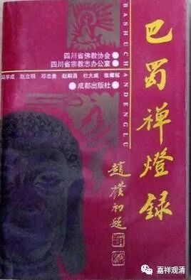

**《微课堂佛教史》225·1**

马祖道一禅师呢，是四川人，所以有一本《巴蜀禅灯录》，也会把马祖道一禅师放进去，因为他是在四川本地人，虽然他开发以后并不在四川活动。《巴蜀禅灯录》出版的时候，重庆还没有建市，如果是放在现在的话，就是巴和蜀要分开了，是吧？巴就是重庆了。

那么，马祖道一禅师是四川哪里人呢？他是什邡人，就是在成都的北边一点。他是在什么地方出家的呢？前面我们不是还谈到过保唐宗嘛，保唐宗里面有一位资州处寂禅师，资州位于现在四川的内江市资中县，处寂禅师的弟子就是那位“金和尚”。马祖道一禅师跟这两位禅师都学过，在处寂禅师门下学过，也在“金和尚”无相禅师门下学过。其实他们就是禅宗的保唐系，或者被称为保唐宗。在圭峰宗密禅师（圭就是两个土的那个圭，峰就是山峰的峰）所著的《禅源诸诠集都序》当中也提到过保唐宗。

 

马祖道一禅师早期就跟保唐宗学过，也是禅宗六祖慧能大师门下的。在禅宗的故事里面，马祖道一禅师是在南岳怀让禅师那里打坐的，对吧？所以他在见南岳怀让以前是学过禅宗的，然后就被南岳怀让禅师一顿修理，是吧？“呵呵，你成佛是打坐就能够成功的吗？……你如果赶牛车的话，是赶车呢，还是赶牛呢？”这个故事应该大家都知道了，我们前面也讲过的。

虽然马祖道一禅师是四川人，但是他活动的核心地域是在江西，所以后来他这一系被称为“洪州禅”（洪州就是今天南昌）。讲“洪州禅”的话实际上就是指的马祖道一禅师。据后来禅宗的史料记载，说是他的门下出一百多员善知识。这个是非常重要的，弟子多，是实力最强的。

道一禅师虽然是四川人，但后来没回过四川。民间有传说他回过四川，南怀瑾先生也说他回过一次四川，但是家里面没人理他，他讲禅宗的内容也没人开悟……这个完全是民间传说。

怎么说的呢？说马祖道一禅师回到四川，开始传播禅宗，但是没人搭理他，最后他碰到了他嫂子。说是他就在房梁上系了一根线吊下来，然后在这根线上绑了一个鸡蛋，说什么时候你能够参出这个鸡蛋的声音，那你就开悟了。于是他嫂子就每天很认真地盯着鸡蛋看，说是看了很久很久（也就是被忽悠了很久）……终于有一天，这根线松了，鸡蛋掉在地上，“啪嗒”一声，据说他嫂子从此就开悟了。

哈哈，这个是小说啊，没有历史记载的。嗯……应该叫什么呢？只有禅宗的丛林里面有这种“发明”的故事，大家千万别太当真！但是丛林里面真的有这样的故事。丛林里面编出这种故事，一是教你要“信”！包括说“生姜是树上长的！”“西瓜是树上长的！”这种，都是禅宗里面叫你“别乱想！师父说啥就是啥！”

