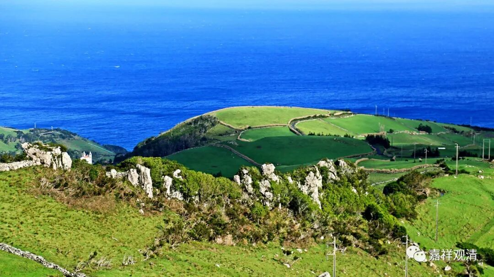
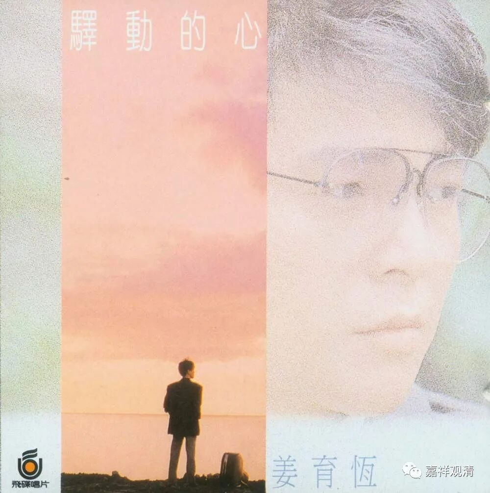

**《微课佛教史》226·2**

那我们正好也可以讲讲百丈怀海禅师的一个故事。

有一次马祖道一禅师他们又到山上去逛（果然逍遥），这时候天上飞来一群野鸭子（不就是大雁吗）。马祖道一禅师就问“这是什么？”，百丈怀海禅师回答：“野鸭子”。马祖道一禅师就问：“啊？你说什么？野鸭子？去哪儿啦？”百丈怀海禅师说“飞过去了”，马祖道一禅师这个时候就把他的鼻子一捏。

讲一讲我个人的理解。

马祖道一禅师确实可能在这个时候勘验他们，但是并没有其它的意思。就是，他在问“这是什么”的时候，更可能是指打坐、修禅定、照顾呼吸、照顾鼻尖等等，是在问你现在的“心、境”，是在考修行。而百丈怀海禅师的心却一下子被外境带走了，他说“野鸭子飞过去了”，那就是离得太远了，所以马祖道一禅师就抓住他的鼻子拧了一下，意思就是“你的念头在哪里！”。

这样说是有道理的。上次我们提到过，其实石头希迁禅师和马祖道一禅师这两支门下的禅修风格是不一样的。石头希迁禅师门下比较注重实际的座上禅修，而马祖道一禅师门下则更注重平时的心的安住（磨砖做镜、打马打车）。所以后来石头希迁禅师门下开出的比较重要的曹洞宗，就“只管打坐”，而马祖道一禅师门下到后来开出的比较重要的临济宗，则非常强调念佛禅、参话头，意思是说，在平时的生活当中，也要把念头提起来。

这两支的禅法思路是不完全一样的。当然，我们也不能说彼此之间没有包含对方的部分，但是他们所强调的部分确实有点不一样。包括马祖道一禅师早先的那个关于要打坐成佛的故事，也很明显地说明了他在南岳怀让禅师那里受到了批评或者点化。

我们前面也讲过了，马祖道一禅师之前是跟从“金和尚”无相禅师学习过的，而无相禅师的保唐宗这一系是特别推崇《思益梵天所问经》的，这部经当中就特别提到禅修并不只是在禅坐上，后来还有“一行三昧”等等的说法。所以马祖道一禅师这一系更加强调的是有点接近于我们今天讲的“动中禅”——就是禅不在坐。那么，这个思路其实在六祖慧能大师的时候也提到了。

好，今天元旦，就先讲到这里吧，谢谢大家！

