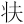
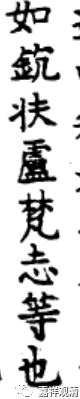
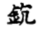

**《成实论》笔记·“䤟扶盧”考**

（一）

《成实论》卷一：

** “又佛世尊知時說法，如䤟扶盧梵志等也。”**

这里，“䤟扶盧梵志”，大正藏本出校勘记，谓：

** “扶【大】，劬【宋】【元】【明】【宮】”**

其中，“宋”，即南宋思溪藏本；“元”，即元普宁藏本；“明”，即嘉兴藏本；“宮”，即日本宮內省圖書寮本（舊宋本）。“大”，即日本大正藏本。

思溪藏、普宁藏、嘉兴藏、宫内本，“䤟扶盧”皆作“䤟劬盧”。

《续卍藏》收《大乘四论玄义记》，其卷六有两则：

** “自有人，雖種善，若不種見佛因緣，終不能得見佛。如䤟扶盧梵志，在山中學道十二年，求佛應之，或云七年，或云五載，不見佛。如參高**（《卍续藏》云“高”当作“商”，当是）** 不得相見。”**

** “感而不應者，一切眾生欲見佛菩薩，而不值見。又如䤟扶盧梵志等。”**

二处皆作“䤟扶盧梵志”，同《大正藏》。

又查《大正藏所收》之《翻梵语·外道名第二十四》，有：

** “欽快盧梵志(譯者曰：樹名也)　《成實論》第一卷”**

则《翻梵语》作者所见《成实论》或为“欽快盧”。

清按：

思溪藏、普宁藏、嘉兴藏，为同一系统刻本大藏经的延续，故收经文字一致。如“又佛世尊知時說法，如䤟扶盧梵志等也”一句中之“佛”字，《大正藏》出校勘记谓：

** “佛【大】，〔－〕【宋】【元】【明】【宮】”**

即，此“佛”字，思溪藏、普宁藏、嘉兴藏、宫内本皆缺。四藏一致，而依上下文，此“佛”字当有。

（二）

检《中华大藏经》（即《赵城金藏》本）——“”字如左“丬”右“夫”——

《字海》谓“”，同“扶”，用的就是“大藏经”（此处应指向《大正藏》）。但“”确实就是“扶”吗？

又，《翻梵语》中释《成实论》之“欽快盧”，与《赵城藏》之“”“”《成实论》字形相近，而释为“树名”。

清按：

此处之“䤟扶盧”等，应为“鈮劬盧”，即nyagrodha。

梵语nyagrodha，巴利语nigrodha，nigoha，汉译諾瞿陀、尼拘盧、尼拘律、尼拘陀、尼俱陀、尼拘律陀，树名，意译为无恚、不瞋、无节。迦叶佛成佛于尼拘律树下，此“尼拘律树”亦即此nyagrodha。

慧琳《一切经音义》卷七十：

“諾瞿陀：

舊言尼俱陁樹，或作尼俱律，或云尼俱類陁，亦言尼拘屢陁，亦言尼拘盧陁，皆一也。舊譯云無節，一云從廣樹。”

如上，则《成实论》等之“䤟扶盧”“䤟劬盧”“欽快盧”，应即此“尼拘盧”——“”之右半与“冗”“欠”及“尼”形近（加金字旁，为音译故意用生僻字），“”、“扶”“快”等，当从思溪藏等，作“劬”（或“拘”），思溪藏、普宁藏、嘉兴藏、宫内本之“劬”不误。

《长阿含》有尼拘陀梵志，住七叶窟，距王舍城及灵鹫山皆不远，弟子众多，而长久未得见佛，后依佛闻法而得解脱——此即《成实论》所谓“佛世尊知時說法”、及《四论玄义记》“䤟扶盧梵志，在山中學道十二年……不見佛，如參商不得相見”中所指之“梵志”。

（又，《四论玄义记》之“参商”指参商二星，此二星不同时出，故云“参商不见”。）

