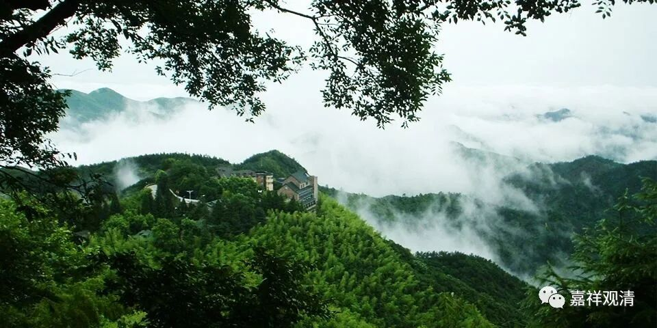

**《微课堂佛教史》231·1**

好，我们继续科学地讲佛教史。

昨天讲到了黄檗希运禅师，他上承百丈怀海禅师，下开临济义玄禅师，所以可以说他是禅宗史上一位非常重要的人物。而且昨天我们也讲到了，他和朝廷高层官员的关系很好，这对于正在成长期中的禅宗而言是非常重要的。

黄檗希运禅师还有几个比较重要的故事（公案），我们不妨来聊一聊。

第一个故事是什么呢？黄檗希运禅师有提出过一句话：“大唐国内无禅师！”他的那个年代应该是唐代的中晚期，这句话说出来是比较嚣张的，肯定会有人不满意。于是有人就问他：“哎，如果你说‘大唐国内无禅师’，那这么多开法的师父怎么说呢？”黄檗希运禅师马上就回应说：“不是无禅，只是无师。”

这个故事也是和其他的禅宗故事一样，很多话是需要你自己去“参”的，他们称之为参，有时候差不多就是猜。如果你不是在当时这个语言环境下的话，你肯定也不知道他在讲什么。

那么，我们大致上来猜一猜他在讲什么。表面上来说，是说有实力的固然不少，但会教学的人没有，。上次我们是不是也谈到过这个问题？就是有些人可能自身的水平和能力确实也不错，但教学上没有能力、没有方法……这个我们放在禅宗里面讲，那就是禅师他自己的禅修水平是不错的（不是无禅），但是他没有去教别人的方法（只是无师）。

呵呵，这种事情我们现在看到的例子就更多了，对吧？很多人甚至是双博士，我认识几位儿童心理学老师夫妻俩都是海归博士，最后他们自己的孩子却是学渣。并不是他们自己学得不好，而是他们没有启发教学的能力。这也是有几方面的原因，怎么说呢？实际上，也有一定的遗传因素，或者是上辈子的原因。另外一方面，上次我也提到了，就是佛教界内部基本上没有开展过类似于教学经验的总结。也不能说没有，是很少。佛教里面从来没有“教育学”这门课，也没有《教学大纲》这样的东西，佛教里的教育方法，还真就是师父们自己“悟”的——甚至有极端的人还奇怪地刻意排斥“教学大纲”之类的正常的教学方法。

另外呢，我们也可以猜，就是一开始可能黄檗希运禅师那句“大唐国内无禅师”这个话说得有点过分，招到圈内的舆论压力，没有办法，不得不给这句话来找个补，呵呵，把这句话再拉回来一点，所以就说“不是无禅，是无师”。你看前面半句气吞山河，后面半句又娓娓道来，风格都变了……

这是其中一个禅宗公案。

