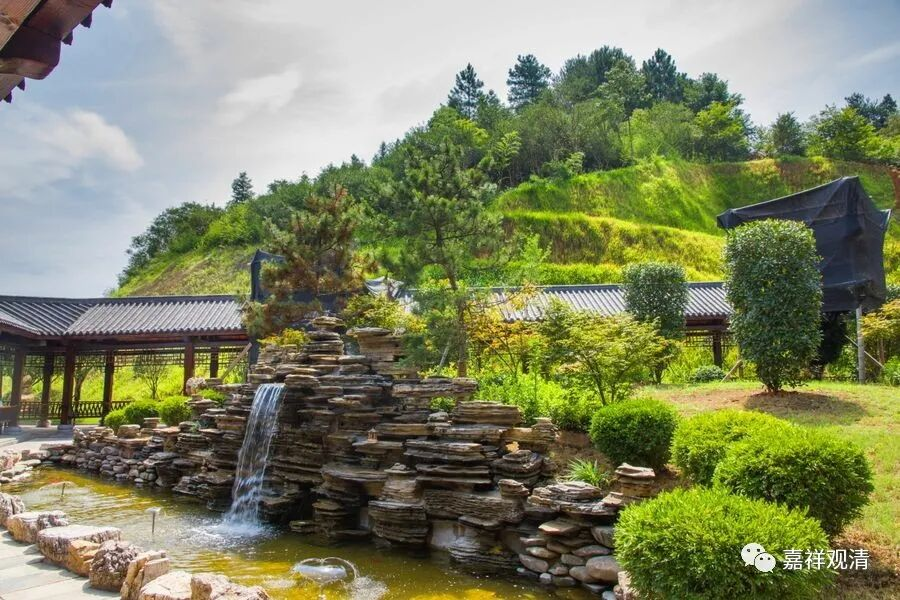

**《微课佛教史》237·2**

我再来谈谈我师父，他也是这样的。他“直心办道场”的时候真的是一点都不怯场，该说的就说，一点都不怯场，哪怕你是什么长啊等等，禅宗的那种话术直接就怼上去了。面对这种怼的力量，用我们这里的方言来讲，人家也是要“吃酸”的。师父就是要“点”你一下，有没有用就不知道了。

当然，师父们其实要“点”你的东西并不是那么多。很多人会说：“今天师父给我讲了一个东西，里面有奥义。”这种情况大部分是大家想多了。还有些人会说：“今天师父给我传了一个秘法。”绝大部分情况下都没有这种事，你自己想想：你到底是不是那个根器？

今天我在看一位法师的年谱，很吓人：一会儿八地，一会儿九地，一会儿就登十地了。都是徒弟们写的。对于这位大师我是非常佩服的，但是这个年谱我不太承认，不太接受。我个人认为这位法师的水平是相当高的，应该算是民国时期实力极强的、属于顶尖的、头部的法师，但是他的那个年谱被他的徒弟们写成这个样子……（希望我别摊上这么热情而又垃圾的徒弟！）

反正让我们这些人来看、比较“唯物”一点的佛教人士来看，那就是非常怪异，八地、九地……这么神吗？有这么厉害吗？为什么会出现这个（《传记》变成神话）情况呢？

我知道这位法师自己的水平是极高的，还不是一般的很高，但他的这帮弟子们水平很臭，师父所写的文集，他们在整理的时候甚至连句读都读不下来，他们曾经让我帮他们句读，我帮他们句读过一篇，后来看他们的水平实在太差，也就不帮他们看了，婉拒了。

就水平这样差的人，还要去给自己的师父写年谱，那里面的很多内容都是莫名其妙的。其中就出现了我们刚才讲的那种情况，比如说wg的时候，师父也许只是说：“我们要守住真心……”可能就是很随便的一句话，然后这帮弟子们就把它理解得妙不可言、高深莫测。我们千万不要把这些话随随便便就放大了。（收到热情澎湃的垃圾徒弟，你一定要祈祷自己长寿，或者先把自传写了，否则……）

当然，禅宗里面也确实会有，就是师父们确实会在特定的时候“点”你一下，但是他也不会预先告诉你。

好，我们再回到临济义玄禅师。刚才讲了，他对禅宗的教学进行了一些总结，整理出一些大致的框架。这个事情其实发展到了清代，就在临济宗内部产生了非常大的争议，什么争议呢？我们刚才讲的，临济宗虽然总结出了一些教学方法，比如四料简，比如三玄三要，但是如果你太刻意地去强调这些，强调他已经总结出来的这些四料简、三玄三要等等，你把每一个都讲“清楚”了：这个就是A，这个就是B……这又不是禅宗了，活力没有了，又变成死东西了。禅宗是非常活泼的，固定程式化以后就变得僵化了——至少我是这样认为的。

到了清代的时候临济宗内部就出现过这种固化风格的情况，完全失去了禅宗的特质。我个人认为，从这个角度来讲，雍正对于禅宗教法和教化的理解，确实要高于当时禅宗的绝大部分“大师”，后来雍正可以说是在大方向上对当时禅宗的“领袖们”进行了批评和指导。我觉得这个批评确实有道理——禅宗总的来讲是很活泼的（很活泼的意思就是，不是那么死板的）。我这句话，可以针对你，是挑你的贪心，针对他，可能是挑他的痴心。这句话的具体作用是怎么样的，是很难文字化、理论化的，是不能把它很严格地、很清楚地用文字写出来的，不能说“A、B、C、D，就是这样”。也许在教下是这样的，但是在禅宗的教学法不是这样的。

今天讲的有点多了（没管住嘴，大家不要对号入座），就先到这里吧，谢谢大家！

