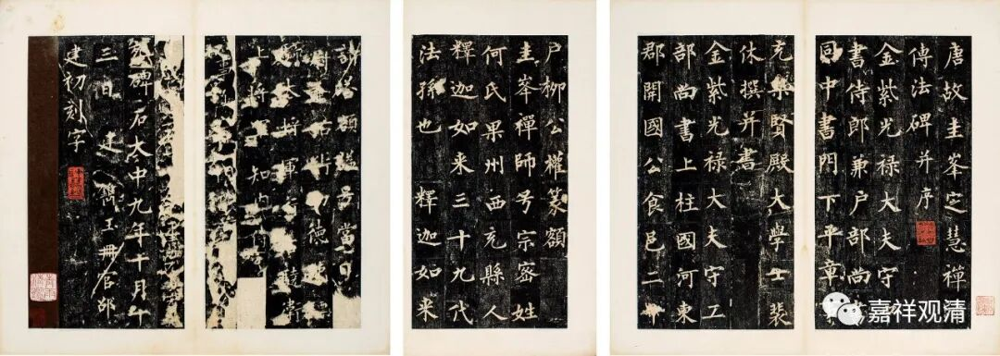
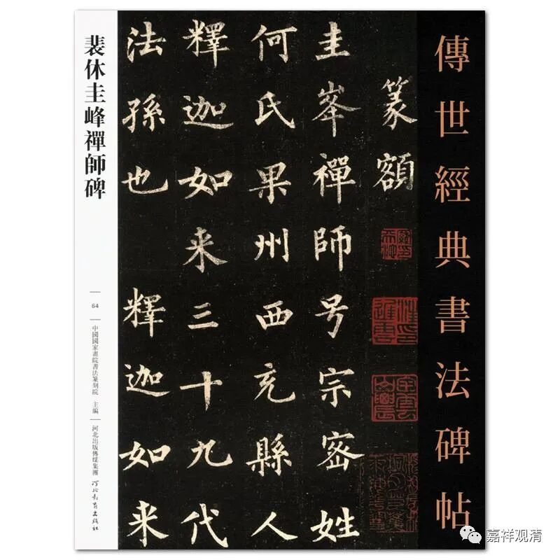
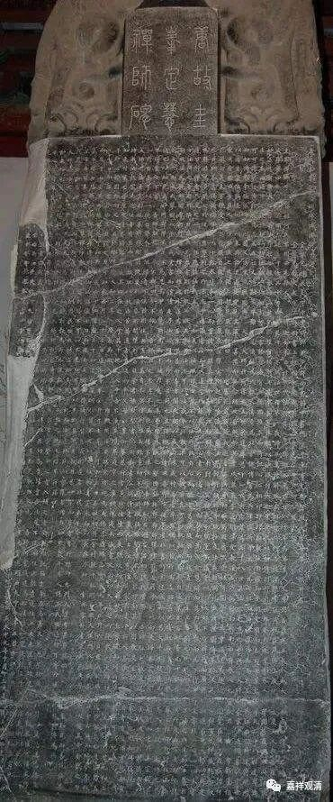

**《微课堂佛教史》241·1**

我们继续科学地参禅，哈哈。

临济玄禅师已经讲过了，我们现在讲课稍微有点跳跃，线索比较多……我们就当在说评书“两朵花开，各表一枝”……

今天又看到另外一个人，我觉得就先讲讲另外这个人吧。他是当时的一个士大夫，前面在讲黄檗希运禅师的时候提到过这个人，其实如果以他为中心的话，还可能会牵涉到一些禅宗史上的重要人物，所以这个人算是那个时代禅宗史里的一个重要的节点，所以我就有兴趣先把这个人提出来讲一讲——他就是裴休。

裴休，可以说是中唐士大夫阶层里的上层人士，是这个阶层里和佛教走得非常近、介入很深的一个人，《居士传》里面给他和苏东坡都留了专门的“版面”。他和圭峰宗密禅师的关系非常好，可以算是圭峰宗密禅师的弟子（实际相处介于师友之间），这个我们就留到讲圭峰宗密禅师的时候再讲。裴休自己也非常明确是禅宗门人，他完全接受自己的这个身份，甚至在禅宗的弘扬上面他有着自觉的使命感。

裴休写过很多佛教内容的序言，圭峰宗密禅师的作品当中基本上都有他写的序。我最近在看一些碑帖（我和别人看碑帖的目的不一样，我不是为了临帖，我主要是把它当作文献来研究的），最近正好看到一幅书法作品——圭峰宗密禅师的碑，也是裴休写的，这就说明裴休和佛教，特别是和禅宗的关系实在是很深的。（大家如果想要临帖的话，有一块裴休写的圭峰宗密禅师的碑帖，现在应该挺便宜的，只有几十块钱。）

前面提到过，裴休和黄檗希运禅师的关系也非常好，他当时在江西做官，可以说黄檗希运禅师就是被他主动发掘、推出的。当时已经到了唐代的中晚期，裴休是在唐宣宗时期做到宰相的。如果我没记错的话，唐宣宗也做过和尚的，可以说这个时候皇帝和宰相都是非常信佛的。唐宣宗最初应该是和径山寺，和牛头系有关系，具体的事情我不记得了，到时候再查一下。而裴休则是和洪州系有关，主要是和黄檗希运禅师有关，然后和菏泽神会禅师门下的圭峰宗密禅师也有关。

