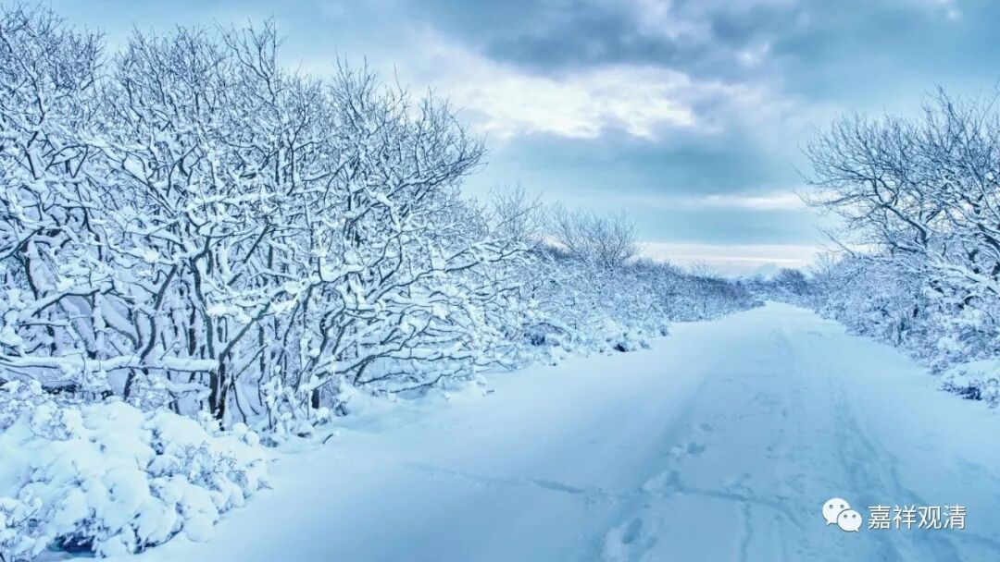
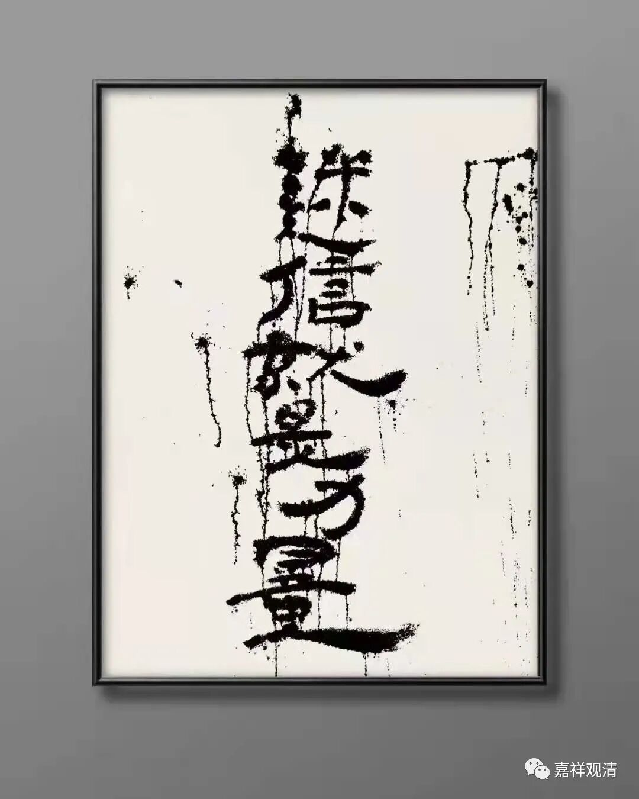

**《微课佛教史》243·2**

前两天我又看到民间宗教版本的初祖、二祖、三祖，在那个《三祖宝卷》当中。我原先以为这个《三祖宝卷》就是“禅宗的三祖”的《宝卷》。但是我错了……这个《三祖宝卷》（民间宗教版）里面讲的“三祖”是指慧可大师，又叫神光大师，是把他当作三祖的（其实，在一般禅宗传统里，神光和慧可是一个人，就是禅宗二祖），所以很乱。

关于民间的“宝卷”，有庞大的未必逊于《大藏经》的规模，我自己准备去买一套来看看（已经买了）。前段时间在拍卖行里面也看到很多类似的书，在中国是出版过一个大全集的，里面民间宗教的内容是非常非常多的。

在民间呢，这些“佛教徒”不会认为“我学的是民间宗教”，比如说，他们不会说“我学的是罗祖教”，或者“我学的是三一教”，或者“我学的是理教”……绝大部分的人不会这么认为的，他们都认为“我学的就是佛教”。所以正统的佛教是挺倒霉的，是吧？拿讲相声的说法来说，正统的佛教就好像“吃好吃的没赶上，倒霉的事都轮到他”，对吧？

民间宗教他们发展迅速的时候，和正统佛教没什么特别大的关系，但是到出问题的时候，比如唐武宗时期一刀切下来的时候，正统佛教的脑袋是先被砍掉的。这个真是挺倒霉的事。

本来我不想讲了，但是讲到这里的话，我就稍微说一下吧。

实际上，我今天基本上是以精英的立场来叙事，来谈这个事情的。我说“我们是科学的，那些是不科学的”，“隔壁是八卦的”等等。但是，真正行走在民间的时候，谁更有市场呢？大家的脚已经投票了，是吧？

比如说像我们这种自认为是非常精英的或者非常正统的佛教，从某种角度来看，就觉得我们是“废人”，我们是在苟延残喘，我们是脱离了市场需求的。好在今天我们处在一个很好的背景条件之下，是什么呢？就是我们已经被唯物主义教育过了，所以很多事情都不需要宗教去“掺和”了。

假如说我们回到一百年前，或者三百年前（这样可能说起来更轻松一点），你们要知道，我作为一个地方性寺院——白云寺的方丈，如果周边区域长期不下雨的话，我是必须要去登坛求雨的，我的“身份”天然赋予我这个“责任”。如果我求雨，却求不下来的话，我这座庙就有点危险了（大旱的年份祈祷不灵的时候，龙王是要被抬出去暴晒的……）。当然，也不至于那么危险，但是作为一座地方性的寺院，它有一个功能就是求雨……所以呢，其实，迷信才是宗教圈的第一需求！（什么？学习？！你在开什么玩笑！！！）

