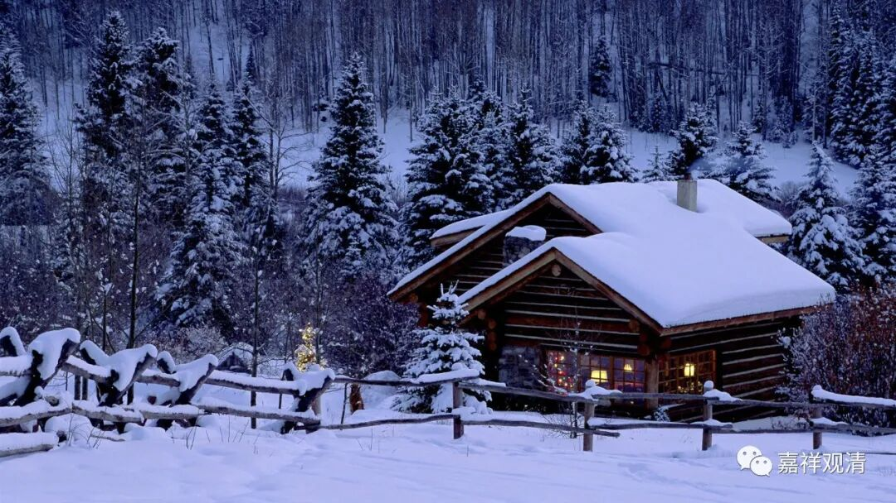
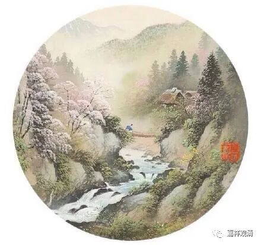
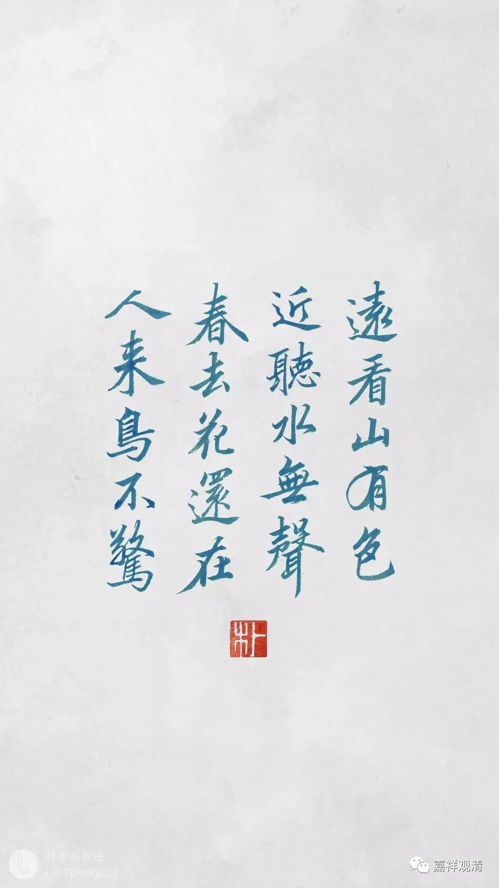

**《微课堂佛教史》244·1**

除了祈雨，寺院还有一个应该有的功能就是治病。比如说信众生了病，就会找到寺院。（当然，我自己会一点中医，还可以解决一部分问题。）基层的寺院，有很多方面的问题，大家都会来找你，这就是旧社会的时候“宗教”所（自带的）要解决的问题。如果你说“我只会讲经，我只会参禅”，基本上你在那个时代是没有办法生存的，基本上没办法生存的。

我以前遇到一个老和尚，文革时候也没还俗，后来在某大山头做“都监”，人很正直，是个好师父。他劝我要会经忏（他俗姓王，当地称他为“经忏王”），要会放焰口……他给我说了一个故事。

解放前，太虚法师有个弟子，是个很有名的法师，他路过NT，讲经数日，反响很好。后面一天有一个“瑜伽焰口”的法会，僧俗都请他主法。法师连连推脱，说实在是不会……大家就死劝：你只要坐在那里就好，我们（僧俗）仪轨都熟，你不用费心……（“经忏王”那个时候还是个居士，也属于瑜伽焰口烂熟于胸的一个。）

法师勉为其难，遂留下来住持“瑜伽焰口”法会，大家帮衬……老和尚告诉我：我们当时在下面念，法师在上面干坐着（做傀儡，很没面子），尴尬不已，又不能随便走开。法会结束后，法师就逃回上海了。据说此后再不参加类似活动。

老和尚说：你看，那么个大法师，学问那么好，因为不会“做法事”，直接在上面下不来台。所以你要补上这门课——不需要精通，至少要会，不然那个场面你就过不去……

可是我到现在也没学这些，也算“自绝于人民”吧。但我也参加过一次“瑜伽焰口”，也是傀儡，只是没坐在中间。那是在某寺院讲《金刚经》，结束后有“瑜伽焰口”，又一个老和尚非留我参加，也是说不用我会……我整个混了一堂，低头看《瑜伽焰口》的仪轨，心里还在挑错：嗯，这个仪轨这里错了……十二缘起咒这里也不对……咦，这首我熟（“远看山有色，静听水无声，春去花还在，人来鸟不惊”，《瑜伽焰口》里有这首诗的演唱版）……后来发供养，我看都没看，直接丢功德箱里了——无功不受禄。（假清高。）

到现在“瑜伽焰口”“大蒙山”“打水陆”我都不会，“瑜伽焰口”还算参加过一次，“水陆法会”我是一次都没参加过。和尚当中我这样的也少见吧，可能上辈子就没积累这些因，希望下辈子也饶过我……《顺治出家诗》里说“天下丛林饭似山，钵盂处处任君餐”，说和尚只要找到庙，就到处都有饭吃，但像我们这样不带技能的其实未必吃得到……

哎？我们怎么会讲到这里来了？哦，是讲到那个“王老师”的称谓。南泉普愿禅师，大家又称之为“王老师”，这个名称更加接地气。“马祖”、“王老师”、“金和尚”……这些名称都是更加接地气的。所以呢，南泉普愿禅师又有一个可能大家更加熟悉一点的名字，在丛林当中有时昵称为“王老师”，这个名字一说，大家就知道是谁了，就是南泉普愿禅师，当时都是这样称呼的。

