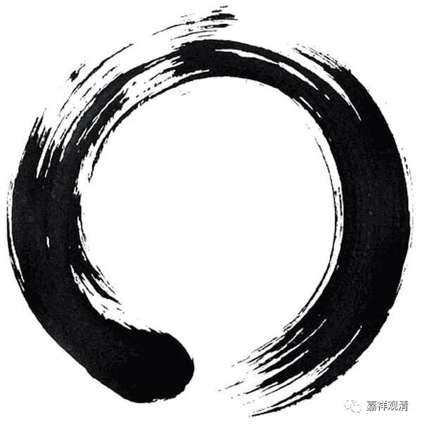

**《微课堂佛教史》245·1**

我们继续来酸酸地讲点科学的佛教。

昨天讲到了南泉普愿禅师，他这里有一则公案，我们还是以科学的方式来讲吧。

就说有一天南泉普愿禅师和归宗禅师、麻谷禅师三个人一起去礼拜南阳慧忠国师，这三个人呢，都是马祖道一禅师的门下。归宗禅师——“归”就是归来的归，“宗”就宗派的宗；麻谷禅师——“麻”就是麻衣道长的麻，“谷”就是山谷的谷。麻衣道长，我们有空的时候可以说一下。前面我们也谈到了，南阳慧忠国师也是禅宗很早期很重要的一位人物。

这三位禅师一起去礼拜南阳慧忠国师，“至中路”，就是在路上，南泉普愿禅师就在地上画了一个圆相，说“道得即去”。我也不知道怎么解释这个“道得即去”，“道得”的意思差不多就是看大家能不能给个好的答案，于是南泉普愿禅师就在地上画了一个圆相。然后，归宗禅师就在圆相当中坐了下来，麻谷禅师则合掌问讯。南泉普愿禅师就说：“恁么则不去也。”意思就是这样的话就不用去了。

这个也是看大家怎么去理解了。“不去也”也有两种解释：一种就是肯定其他两位禅师，也可能是肯定他们，意思就是这样的话你们就不用去参访了，这是可以从正面来解释——合掌、打坐，都是出家人的本分事；另一种就是，如果从负面来解释的话，你们俩都不对，没资格，就别去了。所以有这么两种解释。

至于这件事情到底是怎么回事，画个圆相和在里面坐着和合掌，这些到底是什么意思，在《碧岩录》当中是怎么说的呢？在里面坐着的呢，就是打坐，相当于如来禅，和如来一样，和佛陀一样，意思是，归宗禅师在圆相里打坐这一招，就和一般的佛教一样，不像禅宗。

另外一个麻谷禅师合掌怎么说的呢，在《碧岩录》当中就说这个叫作“女人拜”，是娇柔造作的意思。《碧岩录》的意思是说：南泉普愿禅师不承认这两个人得到了禅宗的精神，一个还是如来家的东西，还不是禅宗自家的东西，另外一个就是娇柔造作，是吧？那你们就不用去了。这是在《碧岩录》当中说的。

那么，我们今天应该怎么解释呢？这个说起来就有点麻烦了。我们现在禅宗当中经常看到有些人画一个圆相，有时候我们自己也可以画。对啊，我今天也可以画个圆相给大家，就是拿支毛笔，在那里这样一蘸，蘸个墨——“哗”，画一个圆，再盖个图章，就可以拿回家去参禅了（哈哈哈哈……）。

