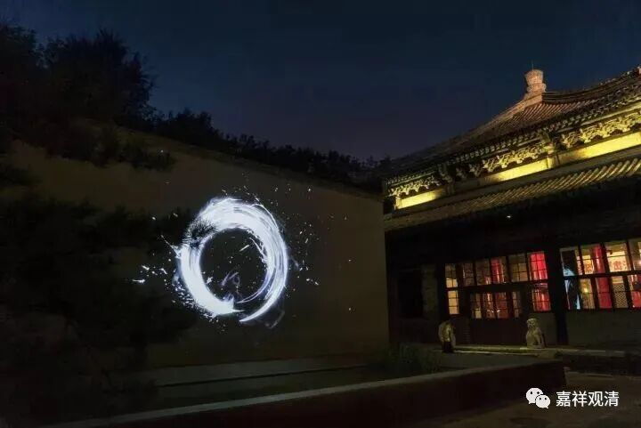
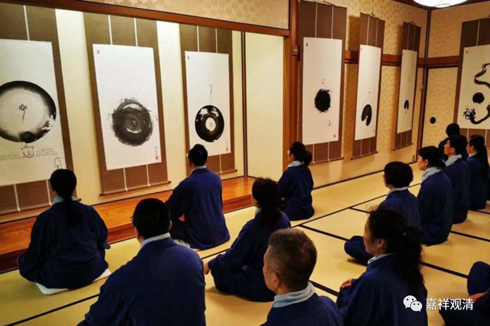

**《微课佛教史》245·2**

在禅宗的后期这个圆相还挺有名的。大家如果去到日本的话，经常可以看到有些禅师画的圆相。日本到现在还存留着禅宗的三个大系——黄蘖宗、曹洞宗和临济宗，从这三个大系当中又分出很多的支流，就是他们上面有一个宗，而下面是很多的流派。

有些禅师就拿一块抹布画圆相的。前两年我自己在画圆相（装叉）的时候，也觉得好像拿块抹布画起来更爽一点。后来祈竹仁波切在写藏文的时候，林聪也让他画了一个圆相，然后把这个圆相打印出来，制作出来，送给大家。这个圆相，让大家感觉很有禅意，是吧？

这个圆相是从禅宗里面出来的，那么圆相的发明者究竟是谁呢？是有点麻烦的。如果是以刚才所讲的《碧岩录》的故事为准，那么就是南泉普愿禅师先在地上画了一个圆相，是吧？但如果我们以历史来考证的话，比较可信的，最早能推到什么时候呢？

一般来说，我们会认为这个圆相最早是从沩仰宗这一支传下来的。沩仰宗这一支的师父是谁呢？还是从马祖道一禅师门下出来的，是沩山灵祐禅师和仰山慧寂禅师，两人同为沩仰宗的祖师。一般从文献上看到的是，圆相是从从仰山禅师这里传下来的，从仰山禅师再往前推，就是南阳慧忠国师。是南阳慧忠国师最早先有了圆相的说法，然后传给耽源禅师，耽源禅师后来再传给沩山禅师，沩山禅师再传给仰山禅师。但是刚才的这个故事就提醒我们圆相最早是从南泉普愿禅师这里开始的……不过呢，“孤证不立”，单纯一个记载还不能完全作数，还需要进一步考察……

我们为什么要专门提这个圆相呢？是因为发展到后来，这个圆相就开始慢慢地演变了。不知道大家对于圆在中国文化当中有没有什么概念，说到圆，大家现在首先想到的是什么？

我先停顿一下，让大家想一想。

